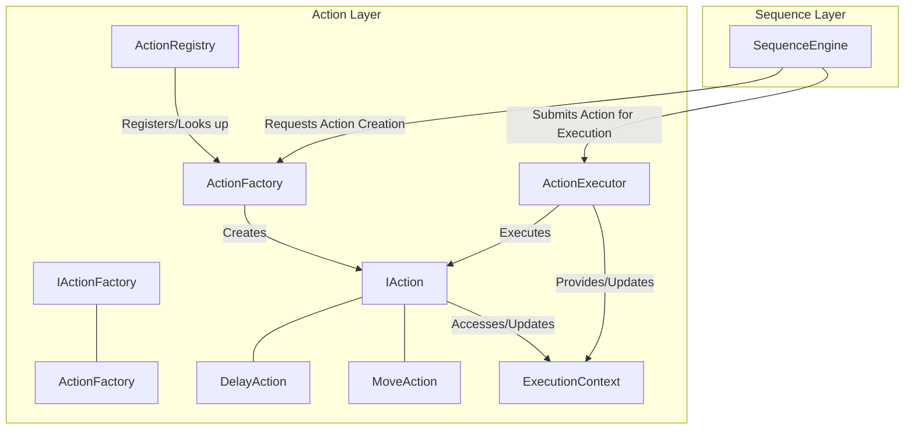

# Action Layer 아키텍처

## 1. 개요

Action Layer는 MXRC 시스템의 가장 기본적인 실행 계층으로, 로봇이 수행하는 개별적이고 원자적인 동작 단위를 정의하고 실행합니다. 이는 로봇 제어의 최소 작업 단위를 캡슐화하며, Sequence Layer에 의해 조합되어 더 복잡한 작업을 구성하는 데 사용됩니다.

주요 특징:
-   **원자성**: 각 Action은 독립적이고 완전한 하나의 동작을 수행합니다.
-   **추상화**: 로봇 하드웨어의 복잡성을 추상화하여 상위 계층에서는 고수준의 동작으로 명령할 수 있도록 합니다.
-   **재사용성**: 한 번 정의된 Action은 다양한 Sequence에서 재사용될 수 있습니다.

## 2. 아키텍처

Action Layer는 여러 핵심 컴포넌트의 유기적인 결합을 통해 동작의 정의, 생성, 실행 및 관리를 수행합니다.

### 2.1. 핵심 구성 요소

-   **`IAction` 인터페이스**:
    -   모든 Action이 구현해야 하는 추상 인터페이스입니다. `execute()`, `cancel()`, `getStatus()`와 같은 메서드를 포함하여 Action의 생명 주기를 정의합니다.
    -   이를 통해 다양한 종류의 Action을 다형적으로 처리할 수 있습니다.

-   **`ActionExecutor`**:
    -   `IAction` 인터페이스를 구현한 특정 Action 인스턴스를 실행하는 역할을 담당합니다.
    -   실행 상태를 관리하고, `ExecutionContext`를 Action에 전달하여 실행 중 필요한 데이터에 접근하거나 결과를 기록하도록 합니다.

-   **`ActionFactory`**:
    -   특정 Action 타입에 대한 `IAction` 인스턴스를 생성하는 팩토리 클래스입니다.
    -   주로 플러그인 방식으로 Action을 로드하거나 동적으로 생성할 때 사용됩니다. `IActionFactory` 인터페이스를 구현하여 다양한 팩토리 구현체를 지원할 수 있습니다.

-   **`ActionRegistry`**:
    -   시스템에 등록된 모든 Action 타입(`ActionFactory`를 통해 생성 가능한 Action)을 관리합니다.
    -   Action 이름을 기반으로 해당 Action을 생성할 수 있는 `ActionFactory`를 찾아주는 역할을 합니다.

-   **`ExecutionContext`**:
    -   Action 실행 전후 또는 Action 간에 데이터를 공유하기 위한 메커니즘을 제공합니다.
    -   일반적으로 key-value 형태의 데이터 저장소로 구현되어, Action이 필요한 정보에 접근하고 실행 결과를 다음 Action으로 전달하는 데 사용됩니다.

### 2.2. 구현체 예시

-   **`DelayAction`**: 지정된 시간 동안 로봇의 동작을 일시 중지하는 간단한 Action입니다.
-   **`MoveAction`**: 로봇을 특정 위치로 이동시키는 Action으로, 실제 로봇 하드웨어 인터페이스와 연동됩니다.

## 3. 데이터 흐름 예시: 로봇 이동 Action 실행

1.  **Sequence 요청**: Sequence Layer의 `SequenceEngine`이 "로봇을 A 지점으로 이동"하는 시퀀스를 실행합니다.
2.  **Action 생성 요청**: `SequenceEngine`은 `ActionRegistry`를 통해 "MoveAction"에 해당하는 `ActionFactory`를 찾아, "MoveAction" 인스턴스 생성을 요청합니다.
3.  **Action 생성**: `ActionFactory`는 필요한 파라미터(예: 목표 위치)를 받아 `MoveAction` 객체를 생성하여 `SequenceEngine`에 반환합니다.
4.  **Action 실행 요청**: `SequenceEngine`은 생성된 `MoveAction` 객체를 `ActionExecutor`에 제출하여 실행을 요청합니다. 이때 `ExecutionContext`가 함께 전달됩니다.
5.  **Action 실행**: `ActionExecutor`는 `MoveAction`의 `execute()` 메서드를 호출합니다. `MoveAction`은 `ExecutionContext`에서 목표 위치를 읽고, 로봇 하드웨어 인터페이스를 통해 실제 이동 명령을 내립니다.
6.  **상태 및 결과 업데이트**: `MoveAction`은 실행 중 또는 완료 후 `ExecutionContext`에 현재 상태나 최종 결과(예: 성공/실패, 도달한 최종 위치)를 기록합니다. `ActionExecutor`는 `getStatus()`를 통해 Action의 진행 상황을 모니터링할 수 있습니다.
7.  **Sequence 진행**: `ActionExecutor`는 `MoveAction`의 실행이 완료되면 `SequenceEngine`에 결과를 통보하고, `SequenceEngine`은 다음 Action 또는 시퀀스 로직을 진행합니다.
