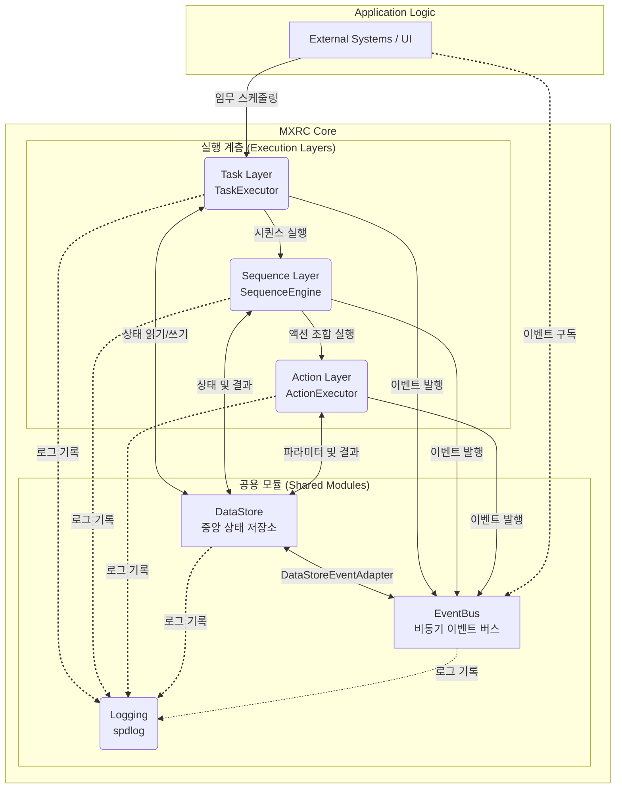
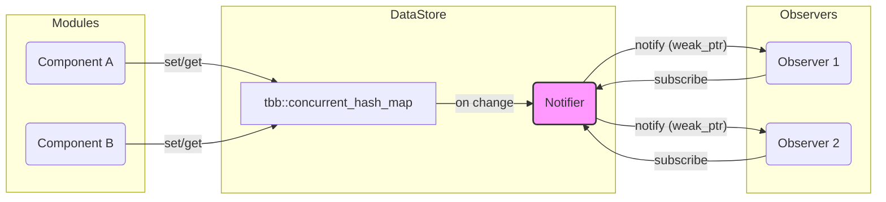

# MXRC 시스템 아키텍처

## 1. 개요

MXRC(Mission and eXecution Robot Controller)는 C++20 기반의 고성능, 고신뢰성 로봇 제어 시스템입니다. 계층형 아키텍처를 채택하여 모듈의 독립성과 테스트 용이성을 극대화하고, 복잡한 로봇 임무를 효율적으로 수행하도록 설계되었습니다.

## 2. 핵심 설계 원칙

-   **계층형 구조 (Layered Architecture)**: 명확한 책임 분리를 위해 Task → Sequence → Action의 3단계 계층 구조를 따릅니다.
-   **RAII 및 스마트 포인터**: 모든 리소스는 스마트 포인터(`shared_ptr`, `unique_ptr`, `weak_ptr`)로 관리하여 메모리 누수와 Dangling 포인터를 원천적으로 방지합니다.
-   **스레드 안전성 (Thread Safety)**: `tbb::concurrent_hash_map`, `std::mutex`, `std::atomic` 등을 적극적으로 사용하여 멀티스레드 환경에서 데이터 무결성과 안정적인 동작을 보장합니다.
-   **테스트 용이성 (Testability)**: 의존성 주입(DI)과 Mocking이 용이하도록 인터페이스 기반으로 설계되었으며, `createForTest()`와 같은 팩토리 메서드를 제공하여 테스트 격리를 지원합니다.
-   **느슨한 결합 (Loose Coupling)**: `EventBus`와 `DataStore`를 통해 모듈 간의 직접적인 의존성을 최소화하여 유연하고 확장 가능한 구조를 지향합니다.

## 3. 고수준 아키텍처

MXRC의 핵심 아키텍처는 **실행 계층(Execution Layers)**과 이들이 공유하는 **공용 모듈(Shared Modules)**로 구성됩니다.



### 블록 다이어그램

```text
+-----------------------------+
|   External Systems / UI     |
+--------------+--------------+
               |
     Schedules |
               v
+-----------------------------+ <--------------------------------------> +-----------------------------+
|         Task Layer          |   (Reads task defs, Writes status)     |                             |
|       (TaskExecutor)        | -------------------------------------> |          DataStore          |
+--------------+--------------+   (Publishes task events)              |   (Central State Storage)   |
               |                                                       |                             |
      Executes |                                                       +--------------+--------------+
               v                                                                      ^
+-----------------------------+ <--> (Reads action results for conditions)            |
|       Sequence Layer        | ---> (Publishes sequence events)                      | (DataStoreEventAdapter)
|      (SequenceEngine)       |                                                       v
+--------------+--------------+                                        +--------------+--------------+
               |                                                       |                             |
  Orchestrates |                                                       |          EventBus           |
               v                                                       |    (Async Event System)     |
+-----------------------------+ <--> (Reads params, Writes results)    |                             |
|         Action Layer          | ---> (Publishes action events)       +--------------+--------------+
|       (ActionExecutor)        |                                                     ^
+-----------------------------+                                                     |
                                                                       +--------------+--------------+
                                                                       |            Logging          |
                                                                       |    (Used by all modules)    |
                                                                       +-----------------------------+
```

-   **실행 계층**: 외부의 명령을 받아 실제 동작으로 변환하는 핵심 흐름입니다.
    -   **Task Layer**: 가장 상위 계층으로, "용접 시작", "물품 운반"과 같은 하나의 완전한 임무(Task)를 관리합니다. `ONCE`, `PERIODIC` 등 실행 모드를 결정합니다.
    -   **Sequence Layer**: Task를 구성하는 동작들의 순서, 조건, 병렬 실행을 조율합니다. 예를 들어, "용접 시작" Task는 '집게 닫기 → 팔 이동 → 용접 실행 → 팔 복귀 → 집게 열기'와 같은 시퀀스로 구성됩니다.
    -   **Action Layer**: 시스템이 수행할 수 있는 가장 기본적인 동작(e.g., `Move`, `Delay`, `GripperControl`)을 실행합니다.

-   **공용 모듈**: 모든 계층이 공유하는 핵심 인프라입니다.
    -   **DataStore**: 시스템의 모든 상태와 데이터를 저장하는 중앙 저장소 역할을 합니다.
    -   **EventBus**: 모듈 간의 통신을 담당하는 비동기 메시징 시스템입니다.
    -   **Logging**: 시스템 전반의 상태, 오류, 이벤트 등을 기록하는 로깅 유틸리티입니다. 모든 컴포넌트에서 사용됩니다.

## 4. 실행 계층과 DataStore의 관계

요청에 따라, 각 실행 계층이 **어떻게 `DataStore`와 상호작용하는지** 명확히 설명합니다.

-   **Task Layer**: `Task`의 현재 상태(`RUNNING`, `COMPLETED`, `FAILED`)나 진행률과 같은 고수준의 정보를 `DataStore`에 기록하여 외부 시스템이 임무의 진행 상황을 쉽게 파악할 수 있도록 합니다.
-   **Sequence Layer**: 이전 `Action`의 실행 결과를 `DataStore`에서 읽어와, 다음 `Action`의 실행 여부를 결정하는 조건부 분기(`Conditional Branch`)에 사용합니다.
-   **Action Layer**: `Action` 실행에 필요한 파라미터(예: 이동할 좌표)를 `DataStore`에서 읽어오거나, `Action`의 결과(예: 센서 측정값)를 `DataStore`에 기록하여 다른 모듈이 사용할 수 있도록 합니다.

이처럼 **모든 실행 계층은 `DataStore`와 긴밀하게 상호작용**하며, 이를 통해 계층 간 데이터 공유 및 시스템 상태의 동기화가 이루어집니다.

## 5. 주요 컴포넌트 상세

### 5.1. 실행 계층 (Execution Layers)

-   **TaskExecutor**: Task의 생명주기와 실행 모드(`ONCE`, `PERIODIC`, `TRIGGERED`)를 관리하며, 적절한 시점에 `SequenceEngine`을 호출합니다.
-   **SequenceEngine**: `SequenceDefinition`에 따라 `Action`들을 순차, 조건부, 병렬로 실행하고 전체 진행 상황을 모니터링합니다.
-   **ActionExecutor**: `IAction` 인터페이스를 구현한 개별 `Action` 객체를 받아 비동기적으로 실행하고 결과를 반환합니다.

### 5.2. DataStore (중앙 상태 저장소)

`DataStore`는 시스템의 두뇌와 기억장치 역할을 하는 스레드 안전한 중앙 데이터 저장소입니다. 로봇의 현재 상태, 센서 값, 설정 파라미터 등 모든 정보가 이곳에 저장되고 공유됩니다.

**주요 특징:**

-   **고성능 동시성**: 내부적으로 Intel TBB의 `concurrent_hash_map`을 사용하여, 여러 스레드가 동시에 데이터를 읽고 쓸 때 발생하는 병목 현상을 최소화했습니다.
-   **안전한 알림 (Observer Pattern)**: `weak_ptr` 기반의 Observer 패턴을 구현하여, 데이터 변경 시 이를 구독하는 다른 모듈에게 안전하게 알림을 보냅니다. 구독자가 파괴되면 자동으로 등록이 해제되어 Dangling Pointer 문제를 방지합니다.
-   **테스트 격리**: `createForTest()` 팩토리 메서드를 제공하여, 단위 테스트 시 각각의 테스트가 독립된 `DataStore` 인스턴스를 사용하도록 보장합니다.



### 5.3. EventBus (비동기 이벤트 버스)

`EventBus`는 시스템의 각 컴포넌트가 서로 직접적인 의존 관계없이 통신할 수 있도록 지원하는 비동기 메시징 시스템입니다.

**주요 특징:**

-   **비동기 처리**: 이벤트 발행(Publish)은 빠르며, 실제 전파(Dispatch)는 별도의 백그라운드 스레드에서 처리되므로, 발행자의 작업 흐름을 방해하지 않습니다.
-   **스레드 안전성**: 여러 스레드가 동시에 이벤트를 발행해도 안전하도록 `std::mutex`로 보호되는 Multi-Producer 큐를 사용합니다.
-   **느슨한 결합**: 이벤트 발행자는 구독자가 누구인지 알 필요가 없으며, 구독자 또한 발행자를 알 필요가 없습니다. `ActionCompleted`, `SequenceFailed` 등 의미 있는 이벤트로만 통신합니다.

## 6. 디렉토리 구조

MXRC 프로젝트는 명확한 책임 분리와 모듈화를 위해 다음과 같은 디렉토리 구조를 가집니다.

```
mxrc/
├── src/
│   ├── core/
│   │   ├── action/              # Action Layer 컴포넌트 (IAction, ActionExecutor 등)
│   │   ├── sequence/            # Sequence Layer 컴포넌트 (SequenceEngine, ConditionEvaluator 등)
│   │   ├── task/                # Task Layer 컴포넌트 (TaskExecutor, PeriodicScheduler 등)
│   │   ├── datastore/           # DataStore 구현
│   │   ├── event/               # EventBus 구현
│   │   ├── logging/             # 로깅 관련 구현 (커스텀 로거, spdlog 설정)
│   │   └── ...                  # 기타 공통/지원 모듈
├── tests/
│   ├── unit/                    # 단위 테스트
│   ├── integration/             # 통합 테스트
│   └── ...
├── docs/                        # 각종 문서 (설계, 가이드 등)
├── specs/                       # 기능 사양서 및 아키텍처 문서
└── ...                          # 빌드 시스템 (CMakeLists.txt), 기타 설정 파일
```

## 7. 모듈별 특징

MXRC의 주요 모듈들은 다음과 같은 고유한 역할과 특징을 가집니다.

### Action Layer
-   **IAction**: 모든 기본 동작이 구현해야 할 인터페이스.
-   **ActionExecutor**: `IAction`을 실행하고 타임아웃, 취소, 결과 수집 등을 관리.
-   **ActionFactory**: `IAction` 인스턴스를 동적으로 생성.
-   **ActionRegistry**: 사용 가능한 `IAction` 타입들을 등록하고 관리.
-   **DataStore 연동**: `Action` 실행에 필요한 파라미터(예: 이동 좌표)를 `DataStore`에서 읽거나, 실행 결과(예: 센서 값)를 `DataStore`에 기록합니다.

### Sequence Layer
-   **SequenceEngine**: `Action`들의 복잡한 조합(순차, 병렬, 조건부 분기)을 조율하고 실행.
-   **ConditionEvaluator**: `Sequence` 내 조건식을 평가하여 실행 흐름을 제어.
-   **RetryHandler**: `Action` 또는 `Sequence` 실패 시 재시도 정책을 적용.
-   **DataStore 연동**: 이전 `Action`의 실행 결과를 `DataStore`에서 읽어와 다음 `Action`의 실행 여부를 결정하는 조건 분기에 사용합니다.

### Task Layer
-   **TaskExecutor**: `Task`의 생명주기를 관리하고 `ONCE`, `PERIODIC`, `TRIGGERED`와 같은 실행 모드를 제어.
-   **PeriodicScheduler**: 주기적으로 `Task`를 실행하도록 스케줄링.
-   **TriggerManager**: 특정 이벤트 발생 시 `Task`를 실행하도록 관리.
-   **DataStore 연동**: `Task`의 전반적인 상태(`RUNNING`, `COMPLETED` 등)를 `DataStore`에 기록하여 외부에서 임무 진행 상황을 모니터링할 수 있게 합니다.

### DataStore
-   **중앙 집중식 데이터 관리**: 시스템의 모든 상태와 파라미터를 저장하고 공유하는 단일 접점.
-   **고성능 & 스레드 안전성**: `tbb::concurrent_hash_map`을 통한 동시성 제어 및 빠른 접근.
-   **옵저버 패턴**: 데이터 변경 시 `weak_ptr` 기반 알림 메커니즘 제공.

### EventBus
-   **비동기 & 느슨한 결합**: 모듈 간 직접적인 의존성 없이 비동기적으로 이벤트를 주고받음.
-   **스레드 안전한 발행**: `std::mutex`를 사용하여 여러 스레드에서 동시에 안전하게 이벤트를 발행.
-   **구독자 생명주기 관리**: `weak_ptr`를 통해 만료된 구독자를 자동으로 정리.

### Logging
-   **듀얼 로깅 시스템**:
    -   **커스텀 'Bag' 로거**: 고속/고용량 구조화된 데이터를 위한 비동기 로거.
    -   **`spdlog`**: 일반적인 진단 메시지(정보, 경고, 오류)를 위한 로거. (현재 비동기 전환 예정)

## 7. 동시성 모델

MXRC는 고성능을 위해 멀티스레딩을 적극 활용하며, 다음과 같은 일관된 동시성 모델을 따릅니다.

-   **데이터 동시성**: `DataStore`와 같이 여러 스레드가 경합하는 데이터는 `tbb::concurrent_hash_map`을 사용하여 세분화된 락(Fine-grained Locking)을 구현합니다.
-   **상태 동시성**: 컴포넌트의 내부 상태나 복잡한 로직은 `std::mutex`로 보호합니다.
-   **플래그 동시성**: `cancelRequested`와 같이 간단한 상태 플래그는 `std::atomic`을 사용하여 락 없이(Lock-free) 처리합니다.
-   **실행 동시성**: `ActionExecutor` 등 비동기 작업은 `std::thread` 또는 `std::async`를 사용하여 백그라운드에서 실행합니다.

## 8. 데이터 흐름 예시: 주기적 센서 읽기

다음은 각 컴포넌트가 어떻게 상호작용하는지 보여주는 간단한 시나리오입니다.

1.  **Task 예약**: 외부 시스템이 "1초마다 센서 값을 읽어라"라는 임무를 `TaskExecutor`에 예약합니다. (`TaskDefinition` 모드: `PERIODIC`)
2.  **Sequence 실행**: `TaskExecutor`는 1초마다 `SequenceEngine`을 호출하여 'ReadSensor' 시퀀스를 실행시킵니다.
3.  **Action 실행**: `SequenceEngine`은 시퀀스에 정의된 `ReadSensorAction`을 `ActionExecutor`에 전달하여 실행합니다.
4.  **데이터 저장**: `ReadSensorAction`은 센서에서 값을 읽은 후, `DataStore`에 `dataStore->set("sensor.temp", 25.5)`와 같이 결과를 저장합니다.
5.  **이벤트 발행**: `DataStore`는 데이터 변경을 감지하고, 이를 구독하고 있던 `DataStoreEventAdapter`에게 알립니다.
6.  **이벤트 전파**: `DataStoreEventAdapter`는 `SensorDataUpdatedEvent` 이벤트를 생성하여 `EventBus`에 발행합니다.
7.  **외부 시스템 수신**: `EventBus`를 구독하고 있던 외부 모니터링 시스템이나 UI가 이벤트를 수신하여 화면에 온도를 갱신합니다.
