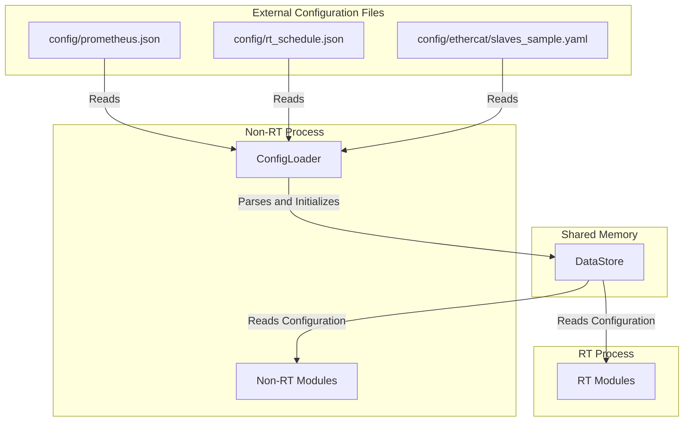

# Config Module 아키텍처

## 1. 개요

Config 모듈은 MXRC 시스템의 설정 정보를 관리하는 역할을 합니다. 시스템 시작 시 필요한 모든 동작 파라미터와 구성을 외부 파일(JSON, YAML 등)로부터 로드하고 파싱하여, 시스템의 초기 상태를 설정하고 다양한 모듈이 이를 참조할 수 있도록 합니다. 이 모듈은 주로 Non-RT 프로세스에서 작동하며, 로드된 설정 값은 `DataStore`를 통해 RT 및 Non-RT 프로세스 전체에 공유됩니다.

주요 특징:
-   **중앙 집중식 설정 관리**: 모든 설정 정보를 외부 파일에서 관리하여 코드와 설정을 분리합니다.
-   **유연한 형식 지원**: JSON, YAML과 같은 표준 데이터 직렬화 형식을 지원하여 설정 작성 및 관리가 용이합니다.
-   **시스템 초기화**: 시스템 시작 시 필수적인 초기화 작업을 수행하여 각 모듈이 올바른 설정으로 동작하도록 합니다.

## 2. 아키텍처

Config 모듈의 핵심은 `ConfigLoader` 클래스이며, 이는 설정 파일을 로드하고 파싱한 후 `DataStore`에 데이터를 초기화하는 역할을 담당합니다.

### 2.1. 핵심 구성 요소

-   **`ConfigLoader`**:
    -   설정 파일(JSON, YAML 등)을 파일 시스템으로부터 읽어옵니다.
    -   읽어온 파일 내용을 파싱하여 프로그램이 이해할 수 있는 내부 데이터 구조로 변환합니다. `nlohmann/json` 라이브러리와 같은 파서가 사용될 수 있습니다.
    -   파싱된 설정 값들을 `DataStore`에 초기값으로 기록합니다. 이때 `DataStore`의 Accessor 패턴(예: `EtherCATConfigAccessor`, `SchedulerConfigAccessor`)을 활용하여 타입 안전하고 도메인 분리된 방식으로 설정 값을 저장할 수 있습니다.

-   **`DataStore`와의 연동**:
    -   `ConfigLoader`는 파싱한 설정 데이터를 `DataStore`에 "단방향"으로 초기화합니다. 이는 `DataStore`가 시스템의 "현재 상태"를 반영하는 역할을 하므로, 설정은 이 상태의 초기값으로 간주됩니다.
    -   RT 및 Non-RT 프로세스의 다른 모든 모듈은 `DataStore`를 통해 필요한 설정 값에 접근합니다. 이는 설정 값이 변경될 때마다 각 모듈이 재컴파일될 필요 없이 유연하게 업데이트될 수 있음을 의미합니다.

### 2.2. 설정 파일 구조

프로젝트의 `config/` 디렉토리는 다양한 시스템 설정 파일을 포함합니다.
-   `config/prometheus.json`: Prometheus 메트릭 수집 및 노출에 대한 설정.
-   `config/rt_schedule.json`: 실시간 스케줄링 및 주기 정보.
-   `config/ethercat/dc_config.yaml`, `slaves_sample.yaml`: EtherCAT 통신 및 슬레이브 장치 구성 정보.
-   `config/ha/failover_policy.json`: 고가용성(HA) failover 정책.
-   `config/rt/cpu_affinity.json`, `numa_binding.json`, `perf_monitor.json`: 실시간 성능 관련 설정.

## 3. 데이터 흐름 예시: 시스템 시작 시 설정 로드

1.  **시스템 시작**: MXRC 시스템의 Non-RT 프로세스(`mxrc-nonrt`)가 시작됩니다.
2.  **`ConfigLoader` 초기화**: Non-RT 프로세스의 메인 함수는 `ConfigLoader`를 초기화하고, `config/` 디렉토리의 경로를 전달합니다.
3.  **설정 파일 읽기 및 파싱**: `ConfigLoader`는 `config/` 디렉토리 내의 정의된 모든 설정 파일(예: `prometheus.json`, `slaves_sample.yaml` 등)을 읽어오고 해당 파일의 형식(JSON/YAML)에 맞춰 내용을 파싱합니다.
4.  **`DataStore` 초기화**: 파싱된 설정 데이터는 `DataStore`의 적절한 키에 초기값으로 `set`됩니다. 이때 `DataStore`의 Accessor를 활용하여 설정 데이터의 타입 안전성을 보장합니다.
5.  **모듈 설정 적용**: `DataStore`가 초기화되면, RT 프로세스와 Non-RT 프로세스의 다른 모든 모듈(예: `EtherCATMaster`, `PeriodicScheduler`, `Monitoring`)은 `DataStore`에서 자신의 동작에 필요한 설정 값들을 읽어와 초기화하거나 동작을 조정합니다.
이 과정을 통해 시스템은 정의된 설정에 따라 일관되게 시작하고 동작할 수 있습니다.
