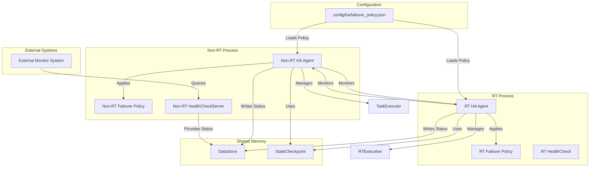

# High Availability (HA) Module 아키텍처

## 1. 개요

HA(High Availability) 모듈은 MXRC 시스템의 고가용성을 보장하는 데 필수적인 역할을 합니다. 이는 주로 Real-Time(RT) 및 Non-Real-Time(Non-RT) 프로세스 간의 상태를 상호 감시하고, 한쪽 프로세스에 장애가 발생할 경우 이를 신속하게 감지하여 시스템을 안전한 상태로 전환하거나 복구 절차를 시작하도록 설계되었습니다. 이를 통해 시스템의 안정성과 연속적인 서비스 제공 능력을 극대화합니다.

주요 특징:
-   **프로세스 활성 감시**: RT 및 Non-RT 프로세스의 정상 작동 여부를 주기적으로 확인합니다.
-   **장애 감지 및 대응**: 프로세스 장애 발생 시 이를 감지하고, 정의된 정책에 따라 복구 작업을 수행합니다.
-   **안전 상태 전환**: 심각한 장애 발생 시 로봇을 안전 모드로 전환하여 추가적인 손상을 방지합니다.
-   **상태 저장 및 복원**: 시스템의 중요 상태를 저장하고 필요시 복원하여 빠른 재시작을 지원합니다.

## 2. 아키텍처

HA 모듈은 RT 및 Non-RT 프로세스 모두에 독립적인 Agent 형태로 존재하며, 서로 통신하며 시스템 전체의 고가용성을 유지합니다.

### 2.1. 핵심 구성 요소

-   **`FailoverManager`**:
    -   장애 감지 시 사전에 정의된 페일오버 정책(`failover_policy.json`)에 따라 시스템 복구 절차를 실행합니다.
    -   로봇의 안전 모드 진입, 프로세스 재시작, 경고 알림 등 다양한 복구 전략을 조정합니다.
    -   RT 및 Non-RT 프로세스 각각에 대한 `FailoverManager`가 존재하여 독립적으로 동작하거나 협력하여 복구 작업을 수행할 수 있습니다.

-   **`ProcessMonitor`**:
    -   RT 및 Non-RT 프로세스 간의 활성 상태를 주기적으로 감시합니다. 주로 하트비트(Heartbeat) 메커니즘을 통해 상대방 프로세스가 정상적으로 작동하는지 확인합니다.
    -   하트비트 실패 횟수, 지연 시간 등을 기록하여 장애 발생 여부를 판단합니다.

-   **`HealthCheck` & `HealthCheckServer`**:
    -   **`HealthCheck`**: 특정 시스템 컴포넌트(예: EtherCAT 통신 상태, DataStore 일관성)의 현재 건강 상태를 점검하는 인터페이스 또는 클래스입니다.
    -   **`HealthCheckServer`**: Non-RT 프로세스에서 실행되며, 외부 모니터링 시스템(예: Prometheus, Kubernetes)이 MXRC 시스템의 전반적인 건강 상태를 HTTP 요청 등을 통해 질의할 수 있는 엔드포인트를 제공합니다.

-   **`StateCheckpoint`**:
    -   시스템의 중요 상태(예: 로봇의 마지막 안전 위치, 현재 작업 상태)를 `DataStore` 또는 영구 저장소에 주기적으로 저장합니다.
    -   장애 발생 후 시스템이 재시작될 때, 저장된 체크포인트로부터 상태를 복원하여 빠른 복구와 작업 연속성을 지원합니다.

### 2.2. 설정 파일

-   `config/ha/failover_policy.json`: 페일오버 정책을 정의하는 파일입니다. 어떤 조건에서 어떤 복구 동작(예: `SAFE_MODE_ENTER`, `REBOOT_PROCESS`, `SEND_ALERT`)을 수행할지 명시합니다.

## 3. 데이터 흐름 예시: RT 프로세스 장애 발생 시 복구

1.  **정상 작동**: RT 프로세스(`mxrc-rt`)와 Non-RT 프로세스(`mxrc-nonrt`)의 `ProcessMonitor`는 주기적으로 서로 하트비트 신호를 교환하며 상대방의 활성 상태를 확인합니다.
2.  **RT 프로세스 장애 발생**: RT 프로세스에서 치명적인 오류(예: 세그멘테이션 폴트)가 발생하여 비정상 종료됩니다.
3.  **장애 감지**: Non-RT 프로세스의 `ProcessMonitor`는 RT 프로세스로부터 더 이상 하트비트 신호를 받지 못함을 감지하고, 이를 `FailoverManager`에 통보합니다.
4.  **페일오버 정책 적용**: Non-RT 프로세스의 `FailoverManager`는 `config/ha/failover_policy.json`에 정의된 정책을 분석합니다. 예를 들어, "RT 프로세스 응답 없음 감지 시 로봇 비상 정지 및 RT 프로세스 재시작" 정책이 발동됩니다.
5.  **복구 절차 시작**:
    -   `FailoverManager`는 `DataStore`를 통해 로봇 시스템에 `EMERGENCY_STOP` 명령을 내립니다.
    -   `StateCheckpoint`를 통해 저장된 최신 안전 상태를 확인합니다.
    -   `systemd` 또는 기타 프로세스 관리자를 통해 RT 프로세스 재시작 명령을 실행합니다.
6.  **RT 프로세스 재시작**: 재시작된 RT 프로세스는 `StateCheckpoint`로부터 이전 상태를 복원하거나, 안전한 초기 상태로 진입합니다.
7.  **시스템 복구 완료**: Non-RT 프로세스는 RT 프로세스가 정상적으로 재시작되고 하트비트 신호가 다시 교환되는 것을 확인한 후, 시스템 복구 완료 상태를 기록하고 외부 모니터링 시스템에 알립니다.

## 4. 개선 제안 반영: 고가용성 정책의 고도화

`docs/research/007-architecture-analysis-and-improvement-proposal.md`에서 제안된 바와 같이, HA 모듈의 고가용성 정책을 고도화하는 것이 중요합니다.
-   **정교한 상태 머신(State Machine) 도입**: 단순히 프로세스 재시작을 넘어, 시스템의 현재 상태(예: `OPERATIONAL`, `DEGRADED`, `SAFE_MODE`, `RECOVERY`)에 따라 유연하게 전환될 수 있는 상태 머신을 `FailoverManager`에 도입합니다. 각 상태 전환 시 실행될 액션과 조건들을 명확히 정의합니다.
-   **다양한 복구 전략**:
    -   `부분 기능 재시작(Partial Function Restart)`: 특정 모듈만 재시작하여 영향 범위를 최소화합니다.
    -   `경고 후 수동 개입 대기(Alert & Await Manual Intervention)`: 심각하지만 즉각적인 자동 복구가 어려운 경우, 경고를 발생시키고 관리자의 개입을 기다립니다.
    -   `동적 리소스 재할당(Dynamic Resource Reallocation)`: 멀티-로봇 시스템이나 분산 환경에서 특정 리소스의 장애 발생 시 다른 리소스로 작업을 전환하는 전략을 포함할 수 있습니다.
-   **예측 및 예방**: 모니터링 데이터(메트릭, 로그)를 기반으로 잠재적 장애를 예측하고 선제적으로 대응하는 로직(예: 비정상적인 자원 사용량 감지 시 경고)을 추가할 수 있습니다.
이러한 개선을 통해 HA 모듈은 단순한 장애 복구를 넘어, 로봇 시스템의 지속적인 운영 안정성을 위한 핵심 지능형 모듈로 발전할 수 있습니다.
