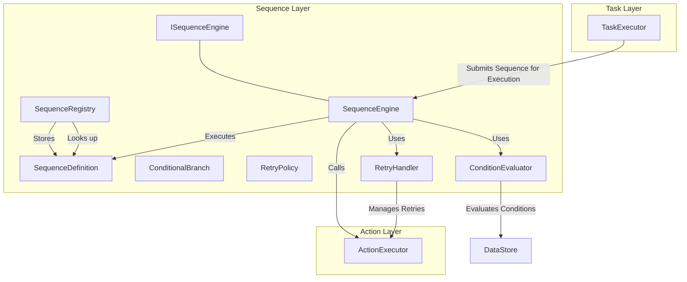

# Sequence Layer 아키텍처

## 1. 개요

Sequence Layer는 MXRC 시스템의 Action Layer 위에 위치하며, 여러 Action들을 논리적으로 조합하여 복잡한 로봇 동작이나 작업 흐름을 정의하고 실행합니다. 이는 단순히 Action을 순차적으로 나열하는 것을 넘어, 조건부 분기, 병렬 실행, 실패 시 재시도 등의 고급 제어 흐름을 지원합니다.

주요 특징:
-   **작업 흐름 정의**: 단일 Action으로는 표현하기 어려운 복잡한 작업을 체계적인 순서와 규칙에 따라 정의합니다.
-   **유연한 제어**: 순차(sequential), 조건부(conditional), 병렬(parallel) 실행 등 다양한 작업 흐름 제어 메커니즘을 제공합니다.
-   **견고성**: Action 실행 중 발생할 수 있는 실패에 대비하여 재시도 정책을 포함할 수 있습니다.

## 2. 아키텍처

Sequence Layer는 시퀀스 정의를 파싱하고, 실행 흐름을 제어하며, 하위 Action Layer와 상호작용하는 여러 컴포넌트로 구성됩니다.

### 2.1. 핵심 구성 요소

-   **`ISequenceEngine` 인터페이스**:
    -   Sequence 실행의 추상 인터페이스를 제공하여, 다양한 `SequenceEngine` 구현체를 지원할 수 있도록 합니다.
    -   주로 `TaskExecutor`와 같은 상위 계층 컴포넌트가 `SequenceEngine`과 상호작용하는 데 사용됩니다.

-   **`SequenceEngine`**:
    -   실제 시퀀스 실행 로직을 담당하는 핵심 컴포넌트입니다.
    -   `SequenceDefinition`에 따라 Action들을 순차적으로 실행하거나, `ConditionEvaluator`를 통해 조건부 분기를 처리하고, `RetryHandler`를 이용해 실패한 Action이나 시퀀스를 재시도합니다.
    -   Action Layer의 `ActionExecutor`를 호출하여 개별 Action을 실행합니다.

-   **`SequenceRegistry`**:
    -   미리 정의된 `SequenceDefinition` 객체들을 저장하고 관리합니다.
    -   시퀀스 이름(ID)을 통해 `SequenceDefinition` 객체를 조회하는 기능을 제공하여, `TaskExecutor`가 특정 시퀀스를 실행할 수 있도록 돕습니다.

-   **`ConditionEvaluator`**:
    -   시퀀스 내에서 조건부 분기(`ConditionalBranch`)에 사용되는 조건식(예: `DataStore`의 특정 값이 특정 범위인지)을 평가합니다.
    -   `==`, `!=`, `<`, `>`, `AND`, `OR` 등 다양한 논리 및 비교 연산을 지원합니다.

-   **`RetryHandler`**:
    -   Action이나 시퀀스 실행 중 발생한 오류에 대한 재시도 정책(`RetryPolicy`)을 관리하고 실행합니다.
    -   최대 재시도 횟수, 재시도 간격, 재시도 시 복구 로직 등을 처리할 수 있습니다.

-   **데이터 전송 객체 (DTO)**:
    -   **`SequenceDefinition`**: 시퀀스의 전체 구조, 포함된 Action들의 목록, 실행 순서, 조건부 분기 등을 정의하는 객체입니다.
    -   **`ConditionalBranch`**: 시퀀스 내에서 특정 조건에 따라 실행 경로를 변경할 때 사용되는 정의입니다.
    -   **`RetryPolicy`**: 특정 Action이나 시퀀스 블록에 적용될 재시도 규칙을 정의합니다.

## 3. 데이터 흐름 예시: 로봇 부품 조립 시퀀스

1.  **Task 요청**: `TaskExecutor`가 "부품 조립" Task를 시작하고, 이 Task는 특정 `SequenceDefinition`을 `SequenceEngine`에 제출합니다.
2.  **시퀀스 실행 시작**: `SequenceEngine`은 `SequenceDefinition`을 파싱하여 첫 번째 Action (예: "부품 픽업")을 `ActionExecutor`에 제출합니다.
3.  **조건부 분기**: "부품 픽업" Action이 성공적으로 완료되면, `SequenceEngine`은 다음 단계로 넘어가기 전 `ConditionEvaluator`를 사용하여 "부품이 올바르게 픽업되었는지" 조건을 평가합니다.
    -   **조건이 참**: "부품 장착" Action을 실행합니다.
    -   **조건이 거짓**: "부품 재시도" 시퀀스 또는 "오류 처리" 시퀀스로 분기합니다.
4.  **재시도 처리**: 만약 "부품 장착" Action 실행 중 오류가 발생하면, `RetryHandler`는 `SequenceDefinition`에 정의된 `RetryPolicy`에 따라 해당 Action을 최대 3번까지 재시도합니다.
5.  **병렬 실행 (선택 사항)**: 만약 시퀀스 정의에 "동시에 두 개의 팔로 부품 고정"과 같은 병렬 Action이 있다면, `SequenceEngine`은 이를 동시에 `ActionExecutor`에 제출하여 병렬로 실행을 조율합니다.
6.  **시퀀스 완료**: 모든 Action이 정의된 흐름에 따라 성공적으로 완료되거나, 재시도 정책을 초과하여 복구 불능 오류가 발생하면 `SequenceEngine`은 Task Layer에 결과를 통보합니다.
