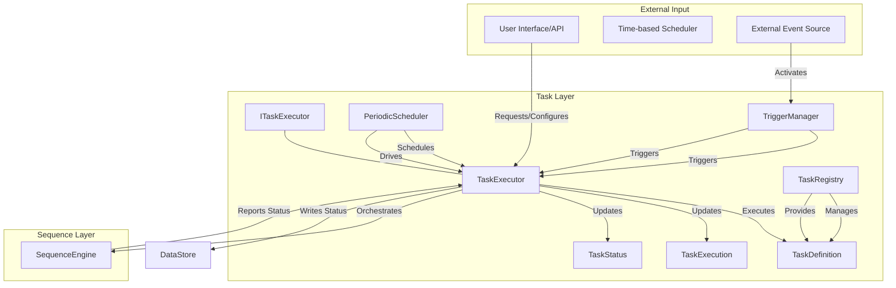

# Task Layer 아키텍처

## 1. 개요

Task Layer는 MXRC 시스템의 최상위 실행 계층으로, 로봇의 전체 임무(mission) 또는 작업을 관리합니다. Sequence Layer에서 정의된 복잡한 동작들을 특정 실행 모드(한 번, 주기적, 트리거 기반)에 따라 실행하고 그 생명주기를 관리하는 역할을 수행합니다. 사용자의 명령, 시스템 이벤트 또는 스케줄에 반응하여 로봇의 동작을 시작, 중지, 모니터링합니다.

주요 특징:
-   **임무 관리**: 로봇 시스템의 고수준 임무를 정의하고 실행 상태를 관리합니다.
-   **실행 모드**: 단일 실행(ONCE), 주기적 실행(PERIODIC), 이벤트 트리거 실행(TRIGGERED) 등 다양한 실행 방식을 지원합니다.
-   **상태 모니터링**: 실행 중인 Task의 진행 상황과 상태를 추적하고 필요에 따라 제어합니다.

## 2. 아키텍처

Task Layer는 Task의 정의, 등록, 스케줄링 및 실행을 담당하는 여러 핵심 컴포넌트들로 구성됩니다.

### 2.1. 핵심 구성 요소

-   **`ITaskExecutor` 인터페이스**:
    -   Task의 실행 및 관리에 대한 추상 인터페이스를 정의합니다. 이를 통해 다양한 Task 실행 방식을 통합된 형태로 처리할 수 있습니다.
    -   `TaskExecutor`의 핵심 역할을 캡슐화합니다.

-   **`TaskExecutor`**:
    -   Task Layer의 핵심 로직을 담당합니다. `TaskDefinition`에 따라 Task를 시작하고, 중지하며, 실행 상태를 모니터링합니다.
    -   실제 로봇 동작을 수행하기 위해 Sequence Layer의 `SequenceEngine`을 호출하고 그 결과를 처리합니다.
    -   Task의 진행 상황과 최종 결과를 `DataStore`에 기록하여 다른 모듈에서 접근할 수 있도록 합니다.

-   **`TaskRegistry`**:
    -   시스템에 등록된 모든 `TaskDefinition` 객체들을 저장하고 관리합니다.
    -   Task ID를 기반으로 `TaskDefinition` 객체를 조회하는 기능을 제공하여, `TaskExecutor`가 특정 Task를 실행할 수 있도록 돕습니다.

-   **`PeriodicScheduler` (개발 중)**:
    -   주기적으로 반복 실행되어야 하는 Task들을 스케줄링하고 `TaskExecutor`에 실행을 지시합니다.
    -   설정된 주기에 따라 Task가 자동으로 실행되도록 관리합니다.

-   **`TriggerManager` (개발 중)**:
    -   특정 외부 이벤트(예: 센서 임계값 초과, 외부 시스템 메시지 수신)가 발생했을 때 연관된 Task를 `TaskExecutor`에 의해 시작하도록 합니다.
    -   `ITriggerProvider` 인터페이스를 통해 다양한 트리거 소스를 지원할 수 있습니다.

-   **데이터 전송 객체 (DTO)**:
    -   **`TaskDefinition`**: Task의 이름, 실행 모드(`TaskExecutionMode`), 참조할 `SequenceDefinition` ID, 스케줄링 정보, 재시도 정책 등 Task의 모든 속성을 정의합니다.
    -   **`TaskExecution`**: 현재 실행 중인 Task 인스턴스의 특정 실행에 대한 런타임 정보(시작 시간, 종료 시간, 현재 상태 등)를 기록합니다.
    -   **`TaskExecutionMode`**: Task가 한 번만 실행될지(`ONCE`), 주기적으로 실행될지(`PERIODIC`), 아니면 이벤트에 의해 트리거될지(`TRIGGERED`)를 정의합니다.
    -   **`TaskStatus`**: Task의 현재 상태(예: `PENDING`, `RUNNING`, `COMPLETED`, `FAILED`, `CANCELLED`)를 나타냅니다.

## 3. 데이터 흐름 예시: 주기적 환경 데이터 수집 Task

1.  **Task 정의 및 등록**: 사용자는 "환경 센서 데이터 수집" Task를 정의합니다. 이 Task는 매 1분마다 `CollectEnvironmentalData` Sequence를 실행하도록 `PERIODIC` 모드로 설정되고, `TaskRegistry`에 등록됩니다.
2.  **스케줄링**: `PeriodicScheduler`는 1분 주기가 도래하면 "환경 센서 데이터 수집" Task의 실행을 `TaskExecutor`에 요청합니다.
3.  **Task 실행 시작**: `TaskExecutor`는 Task를 시작하고, Task의 상태를 `RUNNING`으로 업데이트한 후 `DataStore`에 기록합니다.
4.  **시퀀스 호출**: `TaskExecutor`는 `TaskDefinition`에 지정된 `CollectEnvironmentalData` Sequence를 `SequenceEngine`에 제출하여 실행을 요청합니다.
5.  **Action 실행**: `SequenceEngine`은 내부적으로 여러 Action(예: "온도 센서 읽기", "습도 센서 읽기", "데이터 로깅")을 순차적으로 실행하며, 각 Action은 `ExecutionContext`를 통해 필요한 센서 데이터를 읽고 `DataStore`에 기록합니다.
6.  **Task 상태 업데이트 및 반복**: `CollectEnvironmentalData` Sequence가 완료되면 `SequenceEngine`은 그 결과를 `TaskExecutor`에 통보합니다. `TaskExecutor`는 Task의 상태를 `COMPLETED`로 업데이트하고, 다음 스케줄링 주기가 도래할 때까지 대기합니다.
7.  **모니터링**: 외부 모니터링 시스템은 `DataStore`에서 "환경 센서 데이터 수집" Task의 `TaskStatus`를 주기적으로 읽어와 Task의 정상 작동 여부를 확인합니다.
