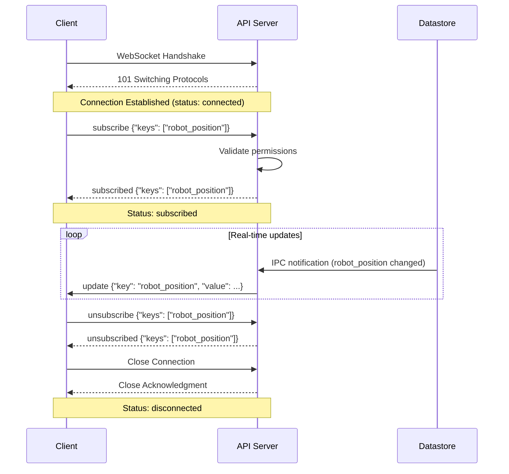

# WebSocket Protocol: MXRC Datastore WebAPI

**Feature**: 001-datastore-webui-api
**Date**: 2025-01-24
**Protocol Version**: 1.0
**Purpose**: Datastore 키 변경 알림을 실시간으로 수신하기 위한 WebSocket 프로토콜 정의

---

## Overview

WebSocket 연결을 통해 클라이언트는 특정 Datastore 키를 구독하고, 해당 키의 값이 변경될 때마다 실시간 알림을 받을 수 있습니다. 이는 RT 프로세스의 데이터를 지연 없이 모니터링하는 데 사용됩니다.

---

## Connection

### Endpoint
```
ws://localhost:PORT/ws
```

- `PORT`: API 서버의 WebSocket 포트 (기본값: 3000)
- **Subprotocol**: `datastore-v1` (선택적)

### Connection Headers

```http
GET /ws HTTP/1.1
Host: localhost:3000
Upgrade: websocket
Connection: Upgrade
Sec-WebSocket-Key: dGhlIHNhbXBsZSBub25jZQ==
Sec-WebSocket-Protocol: datastore-v1
Sec-WebSocket-Version: 13
```

### Connection Lifecycle



---

## Message Format

모든 메시지는 **JSON** 형식으로 전송됩니다.

### Base Message Structure

```json
{
  "type": "string",  // Message type
  ...                // Type-specific fields
}
```

---

## Client → Server Messages

### 1. Subscribe (구독)

특정 Datastore 키들에 대한 변경 알림을 구독합니다.

**Message Type**: `subscribe`

**Format**:
```json
{
  "type": "subscribe",
  "keys": ["key1", "key2", ...]
}
```

**Fields**:
| 필드 | 타입 | 필수 | 설명 |
|------|------|------|------|
| `type` | string | ✅ | `"subscribe"` 고정값 |
| `keys` | array of string | ✅ | 구독할 Datastore 키 목록 (최대 50개) |

**Example**:
```json
{
  "type": "subscribe",
  "keys": ["robot_position", "robot_velocity", "ethercat_sensor_position"]
}
```

**Validation Rules**:
- `keys` 배열은 비어있을 수 없음 (최소 1개)
- 최대 50개 키 동시 구독 가능
- 각 키는 IPC 스키마에 존재해야 함
- 각 키는 `nonrt_read` 권한이 있어야 함

**Server Response**: `subscribed` 또는 `error`

---

### 2. Unsubscribe (구독 해제)

특정 키들에 대한 구독을 해제합니다.

**Message Type**: `unsubscribe`

**Format**:
```json
{
  "type": "unsubscribe",
  "keys": ["key1", "key2", ...]
}
```

**Fields**:
| 필드 | 타입 | 필수 | 설명 |
|------|------|------|------|
| `type` | string | ✅ | `"unsubscribe"` 고정값 |
| `keys` | array of string | ✅ | 구독 해제할 키 목록 |

**Example**:
```json
{
  "type": "unsubscribe",
  "keys": ["robot_velocity"]
}
```

**Validation Rules**:
- `keys` 배열은 비어있을 수 없음
- 구독 중이지 않은 키를 해제해도 오류 없음 (idempotent)

**Server Response**: `unsubscribed` 또는 `error`

---

### 3. Ping (Keep-Alive)

연결 유지를 위한 ping 메시지 (선택적).

**Message Type**: `ping`

**Format**:
```json
{
  "type": "ping"
}
```

**Server Response**: `pong`

---

## Server → Client Messages

### 1. Subscribed (구독 확인)

구독 요청이 성공적으로 처리되었음을 알립니다.

**Message Type**: `subscribed`

**Format**:
```json
{
  "type": "subscribed",
  "keys": ["key1", "key2", ...],
  "timestamp": "2025-01-24T10:05:00.000Z"
}
```

**Fields**:
| 필드 | 타입 | 설명 |
|------|------|------|
| `type` | string | `"subscribed"` 고정값 |
| `keys` | array of string | 구독된 키 목록 |
| `timestamp` | string (ISO 8601) | 구독 시간 |

**Example**:
```json
{
  "type": "subscribed",
  "keys": ["robot_position", "robot_velocity"],
  "timestamp": "2025-01-24T10:05:00.000Z"
}
```

---

### 2. Unsubscribed (구독 해제 확인)

구독 해제가 성공적으로 처리되었음을 알립니다.

**Message Type**: `unsubscribed`

**Format**:
```json
{
  "type": "unsubscribed",
  "keys": ["key1", "key2", ...],
  "timestamp": "2025-01-24T10:06:00.000Z"
}
```

**Fields**:
| 필드 | 타입 | 설명 |
|------|------|------|
| `type` | string | `"unsubscribed"` 고정값 |
| `keys` | array of string | 구독 해제된 키 목록 |
| `timestamp` | string (ISO 8601) | 구독 해제 시간 |

---

### 3. Update (데이터 변경 알림)

구독 중인 키의 값이 변경되었을 때 전송됩니다.

**Message Type**: `update`

**Format**:
```json
{
  "type": "update",
  "key": "string",
  "value": any,
  "version": 12345,
  "timestamp": "2025-01-24T10:30:00.123Z"
}
```

**Fields**:
| 필드 | 타입 | 설명 |
|------|------|------|
| `type` | string | `"update"` 고정값 |
| `key` | string | 변경된 Datastore 키 이름 |
| `value` | any | 새로운 값 (타입은 IPC 스키마에 정의됨) |
| `version` | integer (uint64) | VersionedData 버전 번호 |
| `timestamp` | string (ISO 8601) | 변경 시간 |

**Examples**:

**Vector3d 타입** (robot_position):
```json
{
  "type": "update",
  "key": "robot_position",
  "value": [1.5, 2.3, 0.8],
  "version": 12345,
  "timestamp": "2025-01-24T10:30:00.123Z"
}
```

**array<double, 64> 타입** (ethercat_sensor_position):
```json
{
  "type": "update",
  "key": "ethercat_sensor_position",
  "value": [0.0, 0.1, 0.2, ..., 6.3],
  "version": 67890,
  "timestamp": "2025-01-24T10:30:01.456Z"
}
```

---

### 4. Error (오류)

클라이언트 요청 또는 서버 내부 오류를 알립니다.

**Message Type**: `error`

**Format**:
```json
{
  "type": "error",
  "code": "ERROR_CODE",
  "message": "Human-readable error message",
  "details": { ... }
}
```

**Fields**:
| 필드 | 타입 | 필수 | 설명 |
|------|------|------|------|
| `type` | string | ✅ | `"error"` 고정값 |
| `code` | string | ✅ | 오류 코드 (아래 참조) |
| `message` | string | ✅ | 사람이 읽을 수 있는 오류 메시지 |
| `details` | object | ⬜ | 추가 오류 상세 정보 |

**Error Codes**:

| 코드 | 설명 | 예시 |
|------|------|------|
| `INVALID_MESSAGE` | 잘못된 JSON 또는 메시지 구조 | `{"code": "INVALID_MESSAGE", "message": "Invalid JSON syntax"}` |
| `PERMISSION_DENIED` | 읽기 권한 없음 | `{"code": "PERMISSION_DENIED", "message": "Read permission denied for key 'internal_state'"}` |
| `KEY_NOT_FOUND` | 키가 스키마에 존재하지 않음 | `{"code": "KEY_NOT_FOUND", "message": "Key 'unknown_key' not found in schema"}` |
| `TOO_MANY_KEYS` | 구독 키 개수 초과 (최대 50개) | `{"code": "TOO_MANY_KEYS", "message": "Cannot subscribe to more than 50 keys"}` |
| `RATE_LIMIT_EXCEEDED` | Rate limit 초과 | `{"code": "RATE_LIMIT_EXCEEDED", "message": "Too many messages per second"}` |
| `INTERNAL_ERROR` | 서버 내부 오류 | `{"code": "INTERNAL_ERROR", "message": "IPC connection failed"}` |

**Examples**:

**권한 거부**:
```json
{
  "type": "error",
  "code": "PERMISSION_DENIED",
  "message": "Read permission denied for key 'internal_state'",
  "details": {
    "key": "internal_state",
    "required_permission": "nonrt_read"
  }
}
```

**잘못된 메시지**:
```json
{
  "type": "error",
  "code": "INVALID_MESSAGE",
  "message": "Invalid JSON syntax: Unexpected token } in JSON at position 42"
}
```

---

### 5. Pong (Keep-Alive 응답)

Ping 메시지에 대한 응답.

**Message Type**: `pong`

**Format**:
```json
{
  "type": "pong",
  "timestamp": "2025-01-24T10:30:00.000Z"
}
```

---

## Rate Limiting

WebSocket 메시지도 rate limiting이 적용됩니다:

- **Subscribe/Unsubscribe**: 초당 최대 10 요청
- **Update 알림**: 구독한 키당 초당 최대 100 업데이트 (서버 측 throttle)
- **Ping**: 제한 없음

Rate limit 초과 시 `error` 메시지 전송 후 연결 종료.

---

## Error Handling

### Client-Side Recommendations

1. **자동 재연결**: 연결이 끊어지면 지수 백오프로 재연결 시도
   ```javascript
   let retryDelay = 1000; // 1초부터 시작
   function reconnect() {
     setTimeout(() => {
       connect();
       retryDelay = Math.min(retryDelay * 2, 30000); // 최대 30초
     }, retryDelay);
   }
   ```

2. **구독 복원**: 재연결 후 이전 구독 복원
   ```javascript
   let subscriptions = [];
   ws.on('open', () => {
     if (subscriptions.length > 0) {
       ws.send(JSON.stringify({ type: 'subscribe', keys: subscriptions }));
     }
   });
   ```

3. **Heartbeat**: 주기적으로 ping 전송 (30초마다)
   ```javascript
   setInterval(() => {
     if (ws.readyState === WebSocket.OPEN) {
       ws.send(JSON.stringify({ type: 'ping' }));
     }
   }, 30000);
   ```

### Server-Side Behavior

- 10분 동안 메시지가 없으면 자동으로 연결 종료 (timeout)
- IPC 연결 실패 시 모든 연결에 `error` 메시지 전송 후 연결 유지
- Datastore 키 삭제 시 해당 키 구독자에게 `error` 알림

---

## Security

**현재 버전** (1.0):
- 인증 없음 (localhost 전용)
- CORS: `*` 허용

**향후 계획** (v2.0):
- WebSocket Subprotocol 기반 토큰 인증
- TLS/WSS 지원
- Origin 기반 CORS 제한

---

## Performance Considerations

### Throttling

서버는 과도한 업데이트를 방지하기 위해 throttling을 적용합니다:

- **Hot keys** (high frequency): 초당 100 업데이트로 제한
- **일반 keys**: 초당 10 업데이트로 제한

Throttling 시 최신 값만 전송하고 중간 값은 건너뜁니다.

### Backpressure

WebSocket 버퍼가 가득 차면 (`socket.bufferedAmount > threshold`):
- 서버는 업데이트 전송을 일시 중지
- 클라이언트가 메시지를 소비할 때까지 대기
- 5초 이상 대기 시 연결 종료

---

## Example Implementation

### JavaScript Client

```javascript
const WebSocket = require('ws');

class DatastoreClient {
  constructor(url) {
    this.url = url;
    this.ws = null;
    this.subscriptions = [];
  }

  connect() {
    this.ws = new WebSocket(this.url, 'datastore-v1');

    this.ws.on('open', () => {
      console.log('Connected to Datastore WebAPI');
      // 이전 구독 복원
      if (this.subscriptions.length > 0) {
        this.subscribe(this.subscriptions);
      }
    });

    this.ws.on('message', (data) => {
      const msg = JSON.parse(data);
      this.handleMessage(msg);
    });

    this.ws.on('close', () => {
      console.log('Disconnected, reconnecting...');
      setTimeout(() => this.connect(), 5000);
    });

    this.ws.on('error', (err) => {
      console.error('WebSocket error:', err);
    });
  }

  subscribe(keys) {
    this.subscriptions = [...new Set([...this.subscriptions, ...keys])];
    this.ws.send(JSON.stringify({ type: 'subscribe', keys }));
  }

  unsubscribe(keys) {
    this.subscriptions = this.subscriptions.filter(k => !keys.includes(k));
    this.ws.send(JSON.stringify({ type: 'unsubscribe', keys }));
  }

  handleMessage(msg) {
    switch (msg.type) {
      case 'subscribed':
        console.log('Subscribed to:', msg.keys);
        break;
      case 'update':
        console.log(`Update: ${msg.key} = ${JSON.stringify(msg.value)} (v${msg.version})`);
        break;
      case 'error':
        console.error(`Error: ${msg.code} - ${msg.message}`);
        break;
    }
  }
}

// Usage
const client = new DatastoreClient('ws://localhost:3000/ws');
client.connect();
client.subscribe(['robot_position', 'robot_velocity']);
```

---

## Testing

### Manual Testing (wscat)

```bash
# Install wscat
npm install -g wscat

# Connect
wscat -c ws://localhost:3000/ws -s datastore-v1

# Subscribe
> {"type":"subscribe","keys":["robot_position"]}
< {"type":"subscribed","keys":["robot_position"],"timestamp":"2025-01-24T10:00:00Z"}

# Receive updates
< {"type":"update","key":"robot_position","value":[1.5,2.3,0.8],"version":12345,"timestamp":"2025-01-24T10:00:01Z"}

# Unsubscribe
> {"type":"unsubscribe","keys":["robot_position"]}
< {"type":"unsubscribed","keys":["robot_position"],"timestamp":"2025-01-24T10:00:02Z"}

# Close
> Ctrl+C
```

---

## Changelog

### Version 1.0 (2025-01-24)
- Initial protocol specification
- Subscribe, unsubscribe, update messages
- Error handling and rate limiting

---

**Last Updated**: 2025-01-24
**Status**: Phase 1 - WebSocket Protocol 완료
