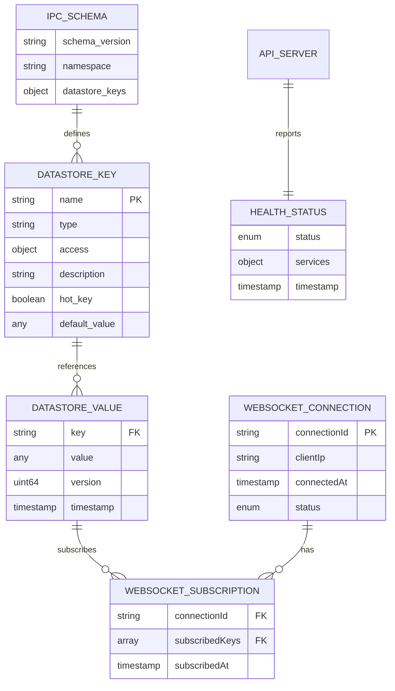

# Data Model: Datastore WebUI API

**Feature**: 001-datastore-webui-api
**Date**: 2025-01-24
**Purpose**: API 서버의 핵심 데이터 모델 및 엔티티 정의

---

## Overview

이 문서는 Datastore WebUI API 서버에서 사용되는 핵심 엔티티와 데이터 구조를 정의합니다. 모든 엔티티는 IPC 스키마(`config/ipc/ipc-schema.yaml`)를 기반으로 하며, TypeScript/Zod를 통해 타입 안전성을 보장합니다.

---

## Entity Diagram



---

## Core Entities

### 1. DatastoreKey (IPC 스키마 키)

**Purpose**: `config/ipc/ipc-schema.yaml`에 정의된 Datastore 키의 메타데이터

**Source**: `ipc-schema.yaml` 파일 (읽기 전용)

**Attributes**:

| 속성 | 타입 | 설명 | 예시 |
|------|------|------|------|
| `name` | string | 키 이름 (고유 식별자) | `"robot_position"` |
| `type` | string | 데이터 타입 | `"Vector3d"`, `"array<double, 64>"` |
| `access` | object | 접근 권한 | `{rt_read: true, rt_write: true, nonrt_read: true, nonrt_write: false}` |
| `description` | string | 키 설명 | `"로봇의 현재 위치 (m 단위, world frame)"` |
| `hot_key` | boolean | Hot path 여부 (고빈도 접근) | `true` |
| `default_value` | any | 기본값 | `[0.0, 0.0, 0.0]` |

**Relations**:
- N/A (독립적인 스키마 정의)

**Validation** (Zod):
```typescript
const DatastoreKeySchema = z.object({
  name: z.string(),
  type: z.string(),
  access: z.object({
    rt_read: z.boolean(),
    rt_write: z.boolean(),
    nonrt_read: z.boolean(),
    nonrt_write: z.boolean(),
  }),
  description: z.string(),
  hot_key: z.boolean().optional(),
  default_value: z.any().optional(),
});

type DatastoreKey = z.infer<typeof DatastoreKeySchema>;
```

**Examples**:
```json
{
  "name": "robot_position",
  "type": "Vector3d",
  "access": {
    "rt_read": true,
    "rt_write": true,
    "nonrt_read": true,
    "nonrt_write": false
  },
  "description": "로봇의 현재 위치 (m 단위, world frame)",
  "hot_key": true,
  "default_value": [0.0, 0.0, 0.0]
}
```

---

### 2. DatastoreValue (Datastore 값)

**Purpose**: Datastore에 저장된 실제 데이터 (공유 메모리에서 IPC를 통해 읽기)

**Source**: MXRC Core Datastore (Unix Domain Socket을 통한 실시간 접근)

**Attributes**:

| 속성 | 타입 | 설명 | 예시 |
|------|------|------|------|
| `key` | string | DatastoreKey 참조 | `"robot_position"` |
| `value` | any | 실제 데이터 값 (타입은 key에 따라 결정) | `[1.5, 2.3, 0.8]` |
| `version` | uint64 | `VersionedData<T>` 버전 번호 | `12345` |
| `timestamp` | Date | 값이 마지막으로 업데이트된 시간 | `"2025-01-24T10:30:00Z"` |

**Relations**:
- `key` → `DatastoreKey.name` (FK)

**Validation** (Zod):
```typescript
// Generic VersionedData wrapper
const VersionedDataSchema = <T extends z.ZodTypeAny>(dataSchema: T) =>
  z.object({
    value: dataSchema,
    version: z.number().int().nonnegative(),
    timestamp: z.date(),
  });

// Specific types
const Vector3dSchema = z.tuple([z.number(), z.number(), z.number()]);
const DoubleArray64Schema = z.array(z.number()).length(64);

// DatastoreValue with specific type
const RobotPositionValueSchema = z.object({
  key: z.literal("robot_position"),
  value: Vector3dSchema,
  version: z.number().int().nonnegative(),
  timestamp: z.date(),
});

type RobotPositionValue = z.infer<typeof RobotPositionValueSchema>;
```

**Examples**:
```json
{
  "key": "robot_position",
  "value": [1.5, 2.3, 0.8],
  "version": 12345,
  "timestamp": "2025-01-24T10:30:00.123Z"
}
```

---

### 3. WebSocketConnection (WebSocket 연결 정보)

**Purpose**: 클라이언트의 WebSocket 연결 상태 관리

**Source**: API 서버 메모리 (런타임 관리)

**Attributes**:

| 속성 | 타입 | 설명 | 예시 |
|------|------|------|------|
| `connectionId` | string | 연결 고유 ID (UUID) | `"a1b2c3d4-e5f6-7890-abcd-ef1234567890"` |
| `clientIp` | string | 클라이언트 IP 주소 | `"192.168.1.100"` |
| `connectedAt` | Date | 연결 생성 시간 | `"2025-01-24T10:00:00Z"` |
| `status` | enum | 연결 상태 | `"connected"`, `"subscribed"`, `"disconnected"` |

**Relations**:
- `1:N` → `WebSocketSubscription`

**State Transitions**:
```
connected → subscribed → disconnected
```

**Validation** (Zod):
```typescript
const WebSocketConnectionSchema = z.object({
  connectionId: z.string().uuid(),
  clientIp: z.string().ip(),
  connectedAt: z.date(),
  status: z.enum(['connected', 'subscribed', 'disconnected']),
});

type WebSocketConnection = z.infer<typeof WebSocketConnectionSchema>;
```

---

### 4. WebSocketSubscription (구독 정보)

**Purpose**: WebSocket 클라이언트가 구독 중인 Datastore 키 관리

**Source**: API 서버 메모리 (런타임 관리)

**Attributes**:

| 속성 | 타입 | 설명 | 예시 |
|------|------|------|------|
| `connectionId` | string | WebSocketConnection 참조 | `"a1b2c3d4-e5f6-7890-abcd-ef1234567890"` |
| `subscribedKeys` | array of string | 구독 중인 키 목록 | `["robot_position", "robot_velocity"]` |
| `subscribedAt` | Date | 구독 시작 시간 | `"2025-01-24T10:05:00Z"` |

**Relations**:
- `connectionId` → `WebSocketConnection.connectionId` (FK)
- `subscribedKeys[*]` → `DatastoreKey.name` (FK array)

**Business Rules**:
- 한 연결당 최대 50개 키 구독 가능
- 존재하지 않는 키 구독 시도 시 오류 반환
- 읽기 권한이 없는 키 구독 시도 시 오류 반환

**Validation** (Zod):
```typescript
const WebSocketSubscriptionSchema = z.object({
  connectionId: z.string().uuid(),
  subscribedKeys: z.array(z.string()).max(50),
  subscribedAt: z.date(),
});

type WebSocketSubscription = z.infer<typeof WebSocketSubscriptionSchema>;
```

**Examples**:
```json
{
  "connectionId": "a1b2c3d4-e5f6-7890-abcd-ef1234567890",
  "subscribedKeys": ["robot_position", "robot_velocity", "ethercat_sensor_position"],
  "subscribedAt": "2025-01-24T10:05:00.000Z"
}
```

---

### 5. HealthStatus (시스템 상태)

**Purpose**: API 서버 및 MXRC Core 프로세스의 health check 결과

**Source**: 실시간 계산 (IPC 연결 상태, systemd service 상태)

**Attributes**:

| 속성 | 타입 | 설명 | 예시 |
|------|------|------|------|
| `status` | enum | 전체 시스템 상태 | `"healthy"`, `"degraded"`, `"unhealthy"` |
| `services` | object | 각 서비스별 상태 | `{"mxrc_rt": "running", "mxrc_nonrt": "running", "api_server": "running"}` |
| `timestamp` | Date | Health check 시간 | `"2025-01-24T10:30:00Z"` |
| `details` | object (optional) | 추가 상세 정보 | `{"ipc_latency_ms": 1.5, "memory_usage_mb": 128}` |

**Relations**:
- N/A (독립적인 상태 정보)

**Status Calculation Logic**:
```
healthy:    모든 서비스 running AND IPC 연결 성공
degraded:   일부 서비스 stopped OR IPC 연결 불안정
unhealthy:  핵심 서비스 stopped OR IPC 연결 실패
```

**Validation** (Zod):
```typescript
const HealthStatusSchema = z.object({
  status: z.enum(['healthy', 'degraded', 'unhealthy']),
  services: z.object({
    mxrc_rt: z.enum(['running', 'stopped', 'failed']),
    mxrc_nonrt: z.enum(['running', 'stopped', 'failed']),
    api_server: z.enum(['running', 'stopped', 'failed']),
  }),
  timestamp: z.date(),
  details: z.object({
    ipc_latency_ms: z.number().optional(),
    memory_usage_mb: z.number().optional(),
    uptime_seconds: z.number().optional(),
  }).optional(),
});

type HealthStatus = z.infer<typeof HealthStatusSchema>;
```

**Examples**:
```json
{
  "status": "healthy",
  "services": {
    "mxrc_rt": "running",
    "mxrc_nonrt": "running",
    "api_server": "running"
  },
  "timestamp": "2025-01-24T10:30:00.000Z",
  "details": {
    "ipc_latency_ms": 1.5,
    "memory_usage_mb": 128,
    "uptime_seconds": 3600
  }
}
```

---

## Type System Integration

### IPC 스키마 → Zod 스키마 변환

`config/ipc/ipc-schema.yaml`의 타입을 Zod 스키마로 자동 변환하는 로직:

```typescript
// src/config/schema-loader.ts
import yaml from 'js-yaml';
import { z } from 'zod';

const typeMap: Record<string, z.ZodTypeAny> = {
  'double': z.number(),
  'int': z.number().int(),
  'string': z.string(),
  'bool': z.boolean(),
  'Vector3d': z.tuple([z.number(), z.number(), z.number()]),
  // array<T, N> 패턴 매칭 필요
};

function parseArrayType(typeStr: string): z.ZodTypeAny | null {
  const match = typeStr.match(/^array<(\w+),\s*(\d+)>$/);
  if (match) {
    const [, elementType, size] = match;
    const elementSchema = typeMap[elementType] || z.any();
    return z.array(elementSchema).length(parseInt(size, 10));
  }
  return null;
}

export function loadIPCSchema(yamlPath: string): Map<string, DatastoreKey> {
  const doc = yaml.load(fs.readFileSync(yamlPath, 'utf8'));
  const keys = new Map<string, DatastoreKey>();

  for (const [keyName, keyDef] of Object.entries(doc.datastore_keys)) {
    const zodSchema = typeMap[keyDef.type] || parseArrayType(keyDef.type) || z.any();
    keys.set(keyName, {
      name: keyName,
      type: keyDef.type,
      access: keyDef.access,
      description: keyDef.description,
      zodSchema, // Runtime validation
    });
  }

  return keys;
}
```

---

## Data Persistence

**Storage Strategy**:
- **DatastoreKey**: 메모리 캐시 (시작 시 YAML 로드, 이후 불변)
- **DatastoreValue**: 공유 메모리 (IPC를 통한 실시간 접근, API 서버에 캐시하지 않음)
- **WebSocketConnection/Subscription**: 메모리 (프로세스 재시작 시 소실, 재연결 필요)
- **HealthStatus**: 매 요청마다 계산 (캐싱 없음)

**Rationale**:
- 모든 데이터의 Source of Truth는 MXRC Core Datastore
- API 서버는 stateless 지향 (확장성 및 장애 복구 용이)
- WebSocket 상태는 휘발성 (클라이언트가 재연결 로직 구현)

---

## Constraints & Validation Rules

### Access Control

**Rules**:
1. HTTP GET → `DatastoreKey.access.nonrt_read === true` 필요
2. HTTP PUT → `DatastoreKey.access.nonrt_write === true` 필요
3. WebSocket Subscribe → `DatastoreKey.access.nonrt_read === true` 필요

**Enforcement**: `schema-validator.js` middleware에서 IPC 스키마 참조

### Data Validation

**Rules**:
1. 모든 값은 IPC 스키마에 정의된 타입과 일치해야 함
2. `array<T, N>` 타입은 정확히 N개 요소 필요
3. `Vector3d`는 3개 숫자 배열로 검증
4. 버전 번호는 uint64 범위 (0 ~ 2^64-1)

**Enforcement**: Zod schema를 사용한 런타임 검증

---

## Performance Considerations

**Hot Keys** (고빈도 접근 키):
- `ipc-schema.yaml`의 `hot_key: true` 키
- 예: `robot_position`, `ethercat_sensor_position`
- 최적화: IPC 연결 풀링, 응답 캐싱 (TTL 100ms)

**Memory Limits**:
- IPC 스키마 캐시: ~1MB (전체 YAML 파싱 결과)
- WebSocket 연결 맵: ~10KB per connection (최대 100 connections = 1MB)
- 총 메모리 목표: 512MB 이하

---

## Next Steps

1. ✅ **Data Model 완료**: 모든 핵심 엔티티 정의
2. ⬜ **API Contracts 작성**: `contracts/openapi.yaml`, `contracts/websocket.md`
3. ⬜ **Quickstart Guide 작성**: `quickstart.md`

---

**Last Updated**: 2025-01-24
**Status**: Phase 1 - Data Model 완료
