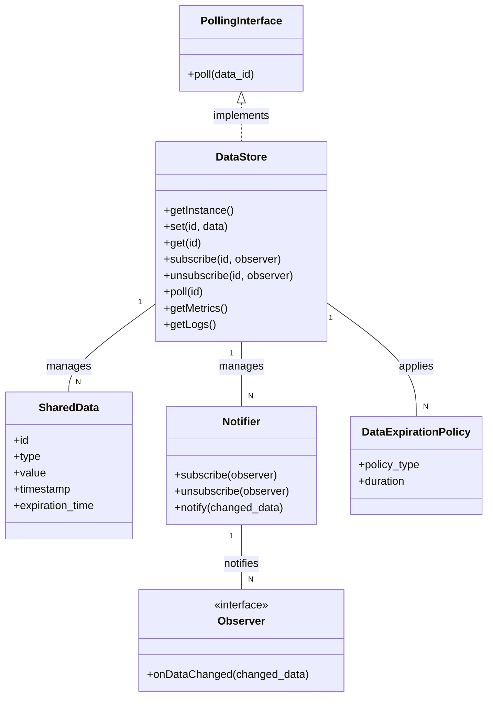

# DataStore 모듈 데이터 모델

## 엔티티

### DataStore
- **설명**: 로봇 시스템의 모든 모듈이 공유하는 데이터를 관리하는 싱글톤 모듈.
- **속성**: 
    - `data_map`: `std::map<std::string, SharedData>` 형태의 내부 데이터 저장소. (키: 데이터 식별자, 값: 공유 데이터 객체)
    - `notifier_map`: `std::map<std::string, Notifier>` 형태의 옵저버 관리 맵. (키: 데이터 식별자, 값: 해당 데이터 변경에 대한 Notifier 객체)
    - `expiration_policies`: `std::map<std::string, DataExpirationPolicy>` 형태의 데이터 만료 정책 관리 맵.
- **관계**: 
    - `SharedData`와 1:N 관계 (DataStore는 여러 SharedData 객체를 포함).
    - `Notifier`와 1:N 관계 (DataStore는 여러 Notifier 객체를 관리).

### SharedData
- **설명**: DataStore에 저장되는 모든 유형의 데이터에 대한 추상화된 표현.
- **속성**: 
    - `id`: `std::string` - 데이터의 고유 식별자.
    - `type`: `DataType` (enum) - 데이터의 유형 (예: RobotMode, InterfaceData, Config, Para, Alarm, Event, MissionState, TaskState).
    - `value`: `std::any` 또는 `std::variant` - 실제 데이터 값 (다형성 지원).
    - `timestamp`: `std::chrono::time_point` - 데이터가 마지막으로 업데이트된 시간.
    - `expiration_time`: `std::chrono::time_point` - 데이터 만료 시간 (선택 사항).
- **관계**: 
    - `DataStore`에 의해 관리됨.

### PollingInterface
- **설명**: 주기적인 데이터 조회를 위한 인터페이스.
- **속성**: 없음 (인터페이스).
- **메서드**: 
    - `poll(const std::string& data_id)`: 특정 `data_id`에 해당하는 최신 데이터를 반환.
- **관계**: 
    - `DataStore`의 특정 데이터(예: InterfaceData)에 대한 접근 방식을 정의.

### Notifier
- **설명**: DataStore 데이터 변경 시 구독자에게 알림을 제공하는 메커니즘 (Observer 패턴).
- **속성**: 
    - `subscribers`: `std::vector<Observer*>` - 해당 데이터 변경에 관심 있는 옵저버 목록.
- **메서드**: 
    - `subscribe(Observer* observer)`: 옵저버를 구독 목록에 추가.
    - `unsubscribe(Observer* observer)`: 옵저버를 구독 목록에서 제거.
    - `notify(const SharedData& changed_data)`: 모든 구독자에게 데이터 변경을 알림.
- **관계**: 
    - `DataStore`에 의해 관리되며, `SharedData` 변경 시 사용됨.

### Observer (인터페이스)
- **설명**: DataStore의 데이터 변경 알림을 수신하는 인터페이스.
- **메서드**: 
    - `onDataChanged(const SharedData& changed_data)`: 데이터 변경 시 호출될 콜백 메서드.

### DataExpirationPolicy
- **설명**: DataStore에 저장된 데이터의 만료를 관리하는 정책.
- **속성**: 
    - `policy_type`: `ExpirationPolicyType` (enum) - 만료 정책 유형 (예: TTL, LRU).
    - `duration`: `std::chrono::duration` - TTL 정책의 경우 데이터 유지 기간.
- **관계**: 
    - `DataStore`에 의해 관리되며, `SharedData` 객체에 적용될 수 있음.

## 관계 다이어그램 (개념적)

