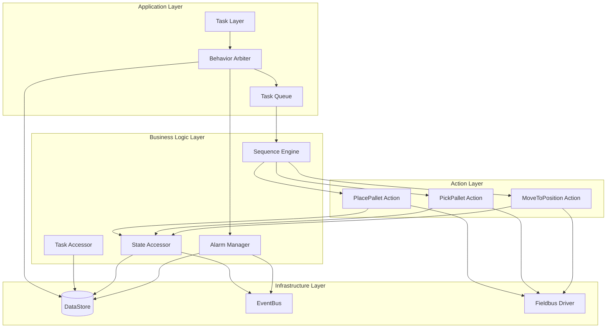
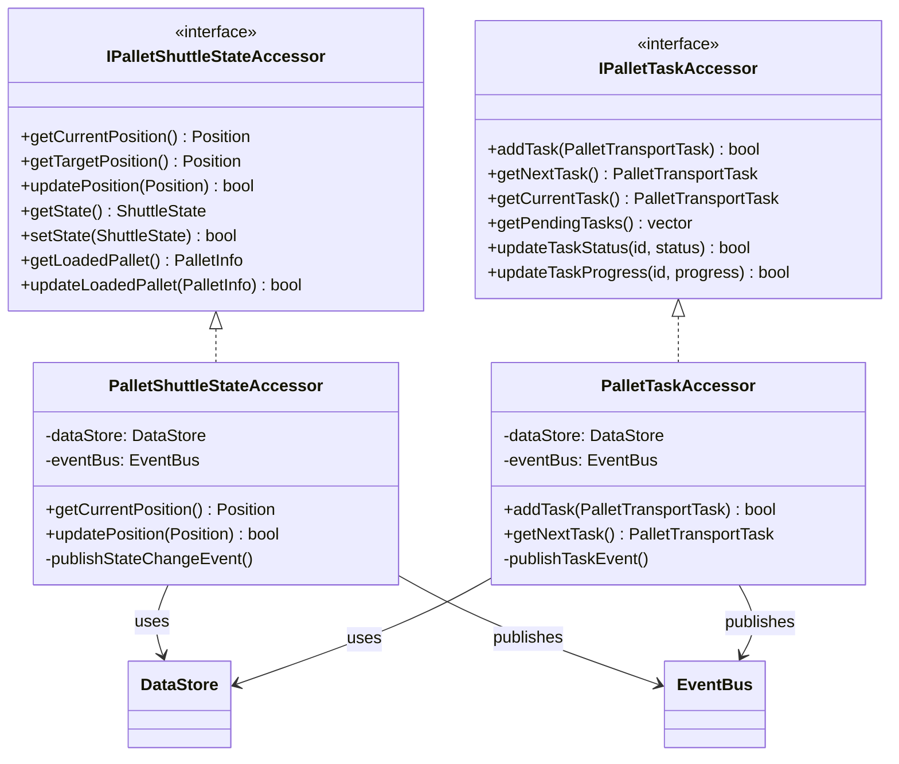
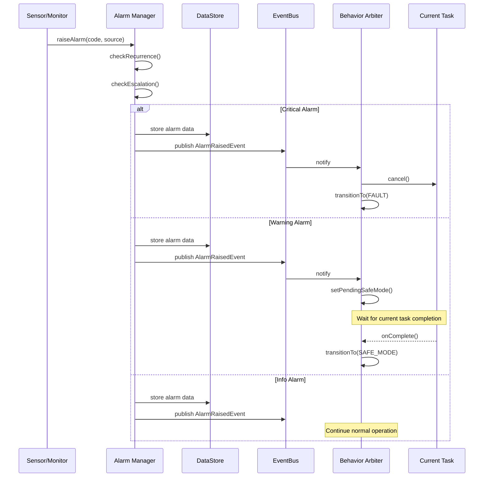
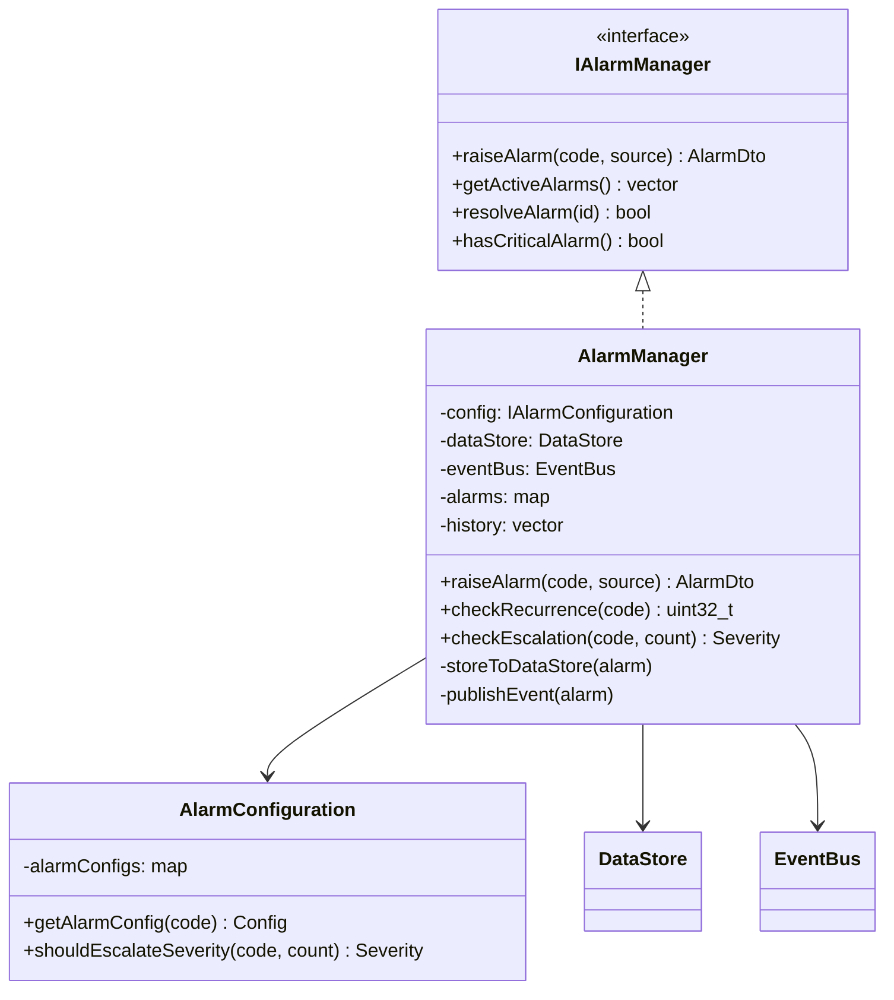
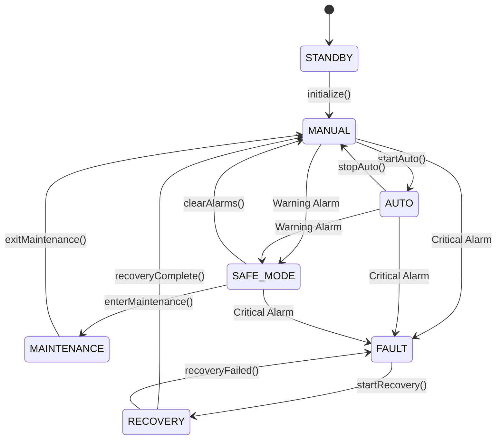
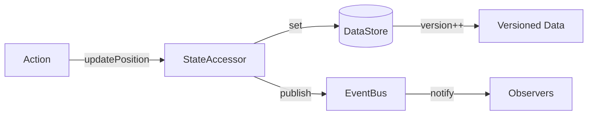
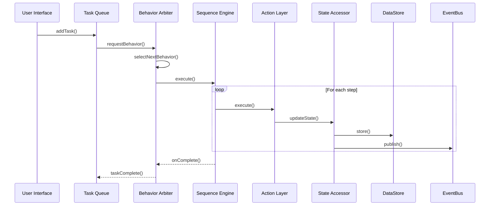

# 팔렛 셔틀 제어 시스템 아키텍처

**Feature**: 016-pallet-shuttle-control
**작성일**: 2025-11-25
**버전**: 1.0

## 1. 시스템 개요

팔렛 셔틀 제어 시스템은 MXRC의 3계층 아키텍처(Action → Sequence → Task)를 기반으로 구축되었으며, 다음의 핵심 컴포넌트로 구성됩니다:



## 2. Accessor 패턴 아키텍처

### 2.1 개요
Feature 022의 권장사항에 따라, DataStore 직접 접근을 방지하고 Accessor 패턴을 통한 간접 접근 방식을 구현했습니다.

### 2.2 Accessor 인터페이스 계층



### 2.3 Accessor 패턴의 장점

1. **캡슐화**: DataStore 구조 변경이 비즈니스 로직에 영향을 주지 않음
2. **테스트 용이성**: Mock Accessor를 통한 격리된 단위 테스트
3. **일관성**: 모든 상태 변경이 Accessor를 통해 이루어져 일관된 이벤트 발행
4. **유지보수성**: DataStore 키 변경 시 Accessor만 수정

### 2.4 DataStore 키 구조

```yaml
# 로봇 상태 관련
pallet_shuttle/position/current: Position     # 현재 위치
pallet_shuttle/position/target: Position      # 목표 위치
pallet_shuttle/state: ShuttleState           # 운영 상태
pallet_shuttle/pallet/loaded: PalletInfo     # 적재된 팔렛

# 메트릭 관련
pallet_shuttle/metrics/current_speed: double
pallet_shuttle/metrics/battery_level: double
pallet_shuttle/metrics/total_distance: double
pallet_shuttle/metrics/completed_tasks: int

# 작업 큐 관련
pallet_shuttle/tasks/queue: vector<Task>      # 대기 중인 작업
pallet_shuttle/tasks/current: Task           # 현재 실행 중인 작업
pallet_shuttle/tasks/completed: vector<Task> # 완료된 작업 이력
```

## 3. Alarm 시스템 아키텍처

### 3.1 Alarm 처리 흐름



### 3.2 Alarm 이벤트 타입

```cpp
// AlarmEvents.h에 정의된 이벤트 타입
enum class AlarmEventType {
    ALARM_RAISED,       // 알람 발생
    ALARM_CLEARED,      // 알람 해제
    ALARM_ESCALATED,    // 심각도 상향
    ALARM_ACKNOWLEDGED  // 운영자 확인
};
```

### 3.3 Alarm Manager 구성



### 3.4 Alarm 심각도 처리

| 심각도 | 처리 방식 | Behavior Arbiter 동작 |
|--------|-----------|---------------------|
| CRITICAL | 즉시 중단 | FAULT 모드 전환, 모든 작업 취소 |
| WARNING | 작업 완료 후 중단 | 현재 작업 완료 후 SAFE_MODE 전환 |
| INFO | 기록만 | 정상 운영 지속, 로깅만 수행 |

## 4. 제어 모드 전환



## 5. 데이터 플로우

### 5.1 상태 업데이트 플로우



### 5.2 작업 실행 플로우



## 6. 성능 목표 및 제약사항

### 6.1 성능 목표
- **Critical Alarm 반응**: < 100ms
- **DataStore 기록**: < 50ms
- **Task 실행 오버헤드**: < 1ms
- **상태 조회 응답**: < 1초

### 6.2 메모리 관리
- 모든 리소스는 RAII 원칙 준수
- shared_ptr/unique_ptr 사용
- Alarm 이력: 최대 1000개 유지
- Task 이력: 최대 100개 유지

### 6.3 동시성 제어
- DataStore: concurrent_hash_map 사용
- EventBus: lock-free queue 사용
- BehaviorArbiter: 100ms tick 주기
- Accessor: thread-safe 구현

## 7. 확장 포인트

### 7.1 새로운 Action 추가
```cpp
class CustomAction : public IAction {
    // 1. IAction 인터페이스 구현
    // 2. StateAccessor 주입
    // 3. execute() 메서드 구현
};
```

### 7.2 새로운 Alarm 타입 추가
```yaml
# alarm-config.yaml에 추가
- code: "ALM_NEW"
  name: "새로운 알람"
  severity: WARNING
  description: "설명"
  escalation_threshold: 3
```

### 7.3 새로운 Accessor 추가
```cpp
class ICustomAccessor {
    // 1. 인터페이스 정의
    // 2. DataStore 키 정의
    // 3. 구현체 작성
    // 4. EventBus 통합
};
```

## 8. 테스트 전략

### 8.1 단위 테스트
- Mock Accessor를 통한 Action 테스트
- Mock Driver를 통한 Fieldbus 테스트
- 격리된 Alarm Manager 테스트

### 8.2 통합 테스트
- End-to-end 시나리오 테스트
- Alarm 처리 플로우 테스트
- 제어 모드 전환 테스트

### 8.3 성능 테스트
- 부하 테스트 (100 tasks/sec)
- 메모리 누수 테스트 (AddressSanitizer)
- 동시성 테스트 (ThreadSanitizer)