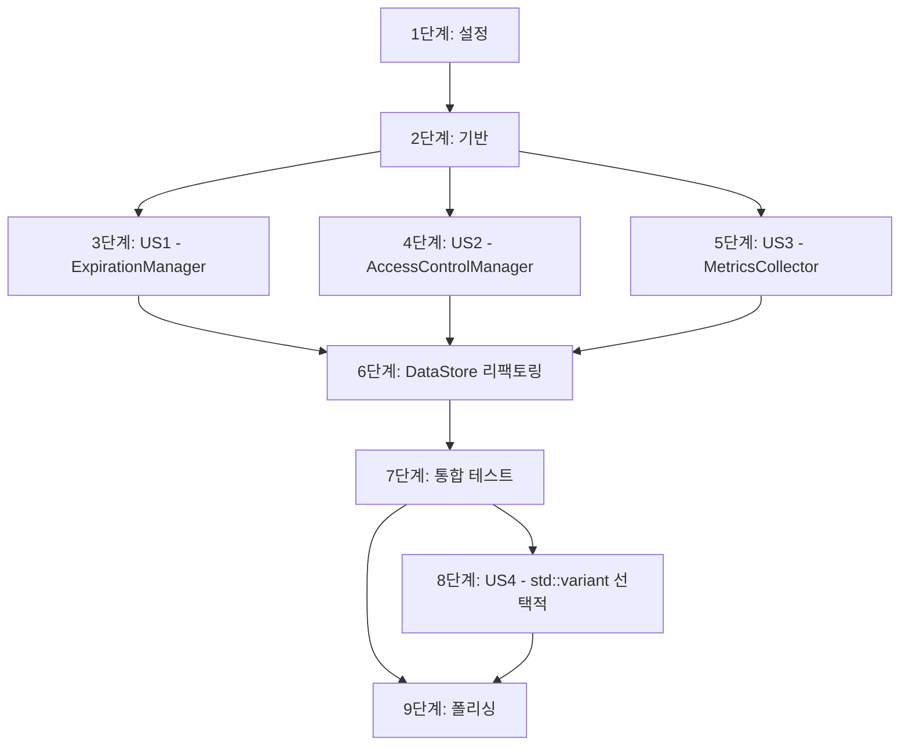

# 작업: DataStore God Object 리팩토링

**입력**: `/specs/017-datastore-god-object-refactor/`의 설계 문서
**전제 조건**: plan.md (필수), spec.md (사용자 스토리)

**테스트**: 명시적으로 요청됨 (SC-001 ~ SC-007). 각 관리자 클래스별 단위 테스트 작성.

**구성**: 작업은 각 사용자 스토리(관리자 클래스)를 독립적으로 구현하고 테스트할 수 있도록 우선순위별로 그룹화됩니다.

## 형식: `[ID] [P?] [Story] 설명`

- **[P]**: 병렬 실행 가능 (다른 파일, 종속성 없음)
- **[Story]**: 이 작업이 속한 사용자 스토리 (US1=ExpirationManager, US2=AccessControlManager, US3=MetricsCollector, US4=std::variant)
- 설명에 정확한 파일 경로 포함

## 경로 규칙

- **단일 프로젝트 (MXRC)**: 리포지토리 루트의 `src/core/datastore/`, `tests/unit/datastore/`
- **관리자 클래스**: `src/core/datastore/managers/` 신규 디렉토리

---

## 1단계: 설정 (공유 인프라)

**목적**: 프로젝트 구조 준비 및 디렉토리 생성

- [ ] T001 src/core/datastore/managers/ 디렉토리 생성
- [ ] T002 tests/unit/datastore/ 디렉토리 확인 (기존 존재 확인)
- [ ] T003 CMakeLists.txt에 새로운 소스 파일 추가 준비 (주석으로 표시)

---

## 2단계: 기반 (블로킹 전제 조건)

**목적**: 리팩토링 전 현재 DataStore 분석 및 안전망 구축

**⚠️ 중요**: 이 단계가 완료될 때까지 관리자 클래스 작업을 시작할 수 없습니다.

- [ ] T004 기존 DataStore_test.cpp 전체 실행 확인 (100% 통과 기준선)
- [ ] T005 DataStore.h의 현재 책임 목록 문서화 (주석으로 작성)
- [ ] T006 [P] DataStore.cpp 현재 줄 수 측정 및 기록 (baseline: ~250줄)
- [ ] T007 [P] 기존 만료 정책 관련 코드 분석 (cleanExpiredData, applyExpirationPolicy)
- [ ] T008 [P] 기존 접근 제어 관련 코드 분석 (setAccessPolicy, hasAccess)
- [ ] T009 [P] 기존 메트릭 관련 코드 분석 (PerformanceMetrics 구조체)

**체크포인트**: 기존 코드 분석 완료 - 이제 관리자 클래스 구현을 병렬로 시작할 수 있습니다.

---

## 3단계: 사용자 스토리 1 - ExpirationManager 분리 (우선순위: P0 - High) 🎯 MVP

**목표**: 만료 정책 관리를 ExpirationManager로 분리하고 O(log N) 성능 달성

**독립 테스트**: ExpirationManager 단위 테스트 10개 + 성능 벤치마크 통과

### 사용자 스토리 1에 대한 테스트 (TDD)

> **참고: 이 테스트를 먼저 작성하고 구현 전에 실패하는지 확인하십시오.**

- [ ] T010 [P] [US1] tests/unit/datastore/ExpirationManager_test.cpp 파일 생성
- [ ] T011 [P] [US1] TEST: ExpirationManager 생성자 및 소멸자 테스트 작성
- [ ] T012 [P] [US1] TEST: applyPolicy() 기본 동작 테스트 작성
- [ ] T013 [P] [US1] TEST: removePolicy() 기본 동작 테스트 작성
- [ ] T014 [P] [US1] TEST: cleanExpiredData() 만료된 데이터만 반환 테스트 작성
- [ ] T015 [P] [US1] TEST: cleanExpiredData() O(log N) 성능 벤치마크 테스트 작성 (1,000개 데이터 < 1ms)
- [ ] T016 [P] [US1] TEST: isExpired() 정확성 테스트 작성
- [ ] T017 [P] [US1] TEST: 만료 정책 업데이트 시 기존 엔트리 제거 테스트 작성
- [ ] T018 [P] [US1] TEST: 빈 키 또는 과거 만료 시간 엣지 케이스 테스트 작성
- [ ] T019 [P] [US1] TEST: 동시성 테스트 - 여러 스레드에서 applyPolicy 호출
- [ ] T020 [P] [US1] TEST: 메모리 누수 테스트 (AddressSanitizer)

### 사용자 스토리 1 구현

- [ ] T021 [P] [US1] src/core/datastore/managers/ExpirationManager.h 파일 생성
- [ ] T022 [P] [US1] ExpirationManager.h에 클래스 선언 작성 (멤버 변수: expiration_map_, key_to_expiration_, mutex_)
- [ ] T023 [US1] ExpirationManager.h에 public API 선언 (applyPolicy, removePolicy, cleanExpiredData, isExpired, getPolicyCount)
- [ ] T024 [US1] src/core/datastore/managers/ExpirationManager.cpp 파일 생성
- [ ] T025 [US1] ExpirationManager.cpp에 applyPolicy() 구현 (std::map + std::unordered_map 업데이트)
- [ ] T026 [US1] ExpirationManager.cpp에 removePolicy() 구현 (양방향 맵 동기화)
- [ ] T027 [US1] ExpirationManager.cpp에 cleanExpiredData() 구현 (O(log N) 알고리즘)
- [ ] T028 [US1] ExpirationManager.cpp에 isExpired() 구현
- [ ] T029 [US1] ExpirationManager.cpp에 getPolicyCount() 구현
- [ ] T030 [US1] CMakeLists.txt에 ExpirationManager.cpp 추가
- [ ] T031 [US1] ExpirationManager 테스트 실행 및 통과 확인 (./run_tests --gtest_filter=ExpirationManager*)

**체크포인트**: 이 시점에서 ExpirationManager는 완전히 작동하고 독립적으로 테스트 가능합니다.

---

## 4단계: 사용자 스토리 2 - AccessControlManager 분리 (우선순위: P1 - Medium)

**목표**: 접근 제어 정책 관리를 AccessControlManager로 분리

**독립 테스트**: AccessControlManager 단위 테스트 8개 통과

### 사용자 스토리 2에 대한 테스트 (TDD)

- [ ] T032 [P] [US2] tests/unit/datastore/AccessControlManager_test.cpp 파일 생성
- [ ] T033 [P] [US2] TEST: AccessControlManager 생성자 및 소멸자 테스트 작성
- [ ] T034 [P] [US2] TEST: setPolicy() 기본 동작 테스트 작성
- [ ] T035 [P] [US2] TEST: hasAccess() 권한 확인 테스트 작성 (허용/거부 케이스)
- [ ] T036 [P] [US2] TEST: removePolicy() 특정 키 정책 제거 테스트 작성
- [ ] T037 [P] [US2] TEST: clearAll() 모든 정책 제거 테스트 작성
- [ ] T038 [P] [US2] TEST: 동시성 테스트 - 여러 스레드에서 hasAccess 읽기
- [ ] T039 [P] [US2] TEST: 엣지 케이스 - 존재하지 않는 키/모듈 접근
- [ ] T040 [P] [US2] TEST: 메모리 누수 테스트 (AddressSanitizer)

### 사용자 스토리 2 구현

- [ ] T041 [P] [US2] src/core/datastore/managers/AccessControlManager.h 파일 생성
- [ ] T042 [P] [US2] AccessControlManager.h에 클래스 선언 작성 (멤버 변수: access_policies_, shared_mutex)
- [ ] T043 [US2] AccessControlManager.h에 public API 선언 (setPolicy, hasAccess, removePolicy, clearAll)
- [ ] T044 [US2] src/core/datastore/managers/AccessControlManager.cpp 파일 생성
- [ ] T045 [US2] AccessControlManager.cpp에 setPolicy() 구현 (쓰기 락)
- [ ] T046 [US2] AccessControlManager.cpp에 hasAccess() 구현 (읽기 락, shared_lock 사용)
- [ ] T047 [US2] AccessControlManager.cpp에 removePolicy() 구현
- [ ] T048 [US2] AccessControlManager.cpp에 clearAll() 구현
- [ ] T049 [US2] CMakeLists.txt에 AccessControlManager.cpp 추가
- [ ] T050 [US2] AccessControlManager 테스트 실행 및 통과 확인 (./run_tests --gtest_filter=AccessControlManager*)

**체크포인트**: AccessControlManager가 독립적으로 작동하며 US1과 함께 병렬 개발 완료.

---

## 5단계: 사용자 스토리 3 - MetricsCollector 분리 (우선순위: P1 - Medium)

**목표**: 성능 메트릭 수집 로직을 MetricsCollector로 분리

**독립 테스트**: MetricsCollector 단위 테스트 6개 통과

### 사용자 스토리 3에 대한 테스트 (TDD)

- [ ] T051 [P] [US3] tests/unit/datastore/MetricsCollector_test.cpp 파일 생성
- [ ] T052 [P] [US3] TEST: MetricsCollector 생성자 및 소멸자 테스트 작성
- [ ] T053 [P] [US3] TEST: incrementGet/Set/Delete() 카운터 증가 테스트 작성
- [ ] T054 [P] [US3] TEST: getMetrics() 메트릭 조회 테스트 작성
- [ ] T055 [P] [US3] TEST: reset() 카운터 초기화 테스트 작성
- [ ] T056 [P] [US3] TEST: 동시성 테스트 - 여러 스레드에서 카운터 증가 (원자성 확인)
- [ ] T057 [P] [US3] TEST: 메모리 누수 테스트 (AddressSanitizer)

### 사용자 스토리 3 구현

- [ ] T058 [P] [US3] src/core/datastore/managers/MetricsCollector.h 파일 생성
- [ ] T059 [P] [US3] MetricsCollector.h에 클래스 선언 작성 (멤버 변수: atomic<uint64_t> 카운터들)
- [ ] T060 [US3] MetricsCollector.h에 public API 선언 (incrementGet, incrementSet, incrementDelete, updateMemoryUsage, getMetrics, reset)
- [ ] T061 [US3] src/core/datastore/managers/MetricsCollector.cpp 파일 생성
- [ ] T062 [US3] MetricsCollector.cpp에 incrementGet/Set/Delete() 구현 (fetch_add with memory_order_relaxed)
- [ ] T063 [US3] MetricsCollector.cpp에 updateMemoryUsage() 구현
- [ ] T064 [US3] MetricsCollector.cpp에 getMetrics() 구현 (atomic load)
- [ ] T065 [US3] MetricsCollector.cpp에 reset() 구현 (atomic store 0)
- [ ] T066 [US3] CMakeLists.txt에 MetricsCollector.cpp 추가
- [ ] T067 [US3] MetricsCollector 테스트 실행 및 통과 확인 (./run_tests --gtest_filter=MetricsCollector*)

**체크포인트**: 모든 관리자 클래스(US1, US2, US3)가 독립적으로 작동합니다.

---

## 6단계: DataStore 리팩토링 - 퍼사드 패턴 적용

**목표**: DataStore를 퍼사드로 변경하고 관리자에게 위임

**독립 테스트**: 기존 DataStore_test.cpp 100% 통과 (하위 호환성 보장)

### DataStore 리팩토링 구현

- [ ] T068 DataStore.h에 관리자 멤버 변수 추가 (unique_ptr<ExpirationManager>, unique_ptr<AccessControlManager>, unique_ptr<MetricsCollector>)
- [ ] T069 DataStore.cpp 생성자에서 관리자 초기화 (std::make_unique)
- [ ] T070 DataStore.cpp의 applyExpirationPolicy() 메서드를 ExpirationManager::applyPolicy()로 위임 변경
- [ ] T071 DataStore.cpp의 removeExpirationPolicy() 메서드를 ExpirationManager::removePolicy()로 위임 변경
- [ ] T072 DataStore.cpp의 cleanExpiredData() 메서드를 ExpirationManager::cleanExpiredData()로 위임 변경 (반환된 키로 data_map_ 정리)
- [ ] T073 DataStore.cpp의 setAccessPolicy() 메서드를 AccessControlManager::setPolicy()로 위임 변경
- [ ] T074 DataStore.cpp의 hasAccess() 메서드를 AccessControlManager::hasAccess()로 위임 변경
- [ ] T075 DataStore.cpp의 set() 템플릿에서 MetricsCollector::incrementSet() 호출 추가
- [ ] T076 DataStore.cpp의 get() 템플릿에서 MetricsCollector::incrementGet() 호출 추가
- [ ] T077 DataStore.cpp의 getPerformanceMetrics() 메서드를 MetricsCollector::getMetrics()로 위임 변경
- [ ] T078 DataStore.cpp의 기존 expiration_policies_, access_policies_, PerformanceMetrics 멤버 변수 제거
- [ ] T079 DataStore.cpp에서 불필요한 mutex_ 사용 코드 정리 (관리자가 자체 락 관리)
- [ ] T080 DataStore.cpp 파일 크기 확인 (<150줄 목표)
- [ ] T081 기존 DataStore_test.cpp 전체 실행 (100% 통과 확인 - SC-004)

**체크포인트**: DataStore 리팩토링 완료, 기존 테스트 100% 통과로 하위 호환성 확인.

---

## 7단계: 통합 테스트 및 성능 검증

**목표**: 리팩토링된 시스템 전체 통합 테스트 및 성능 검증

### 통합 테스트 작성

- [ ] T082 [P] tests/unit/datastore/DataStoreRefactor_integration_test.cpp 파일 생성
- [ ] T083 [P] TEST: DataStore + ExpirationManager 통합 동작 테스트 작성
- [ ] T084 [P] TEST: DataStore + AccessControlManager 통합 동작 테스트 작성
- [ ] T085 [P] TEST: DataStore + MetricsCollector 통합 동작 테스트 작성
- [ ] T086 [P] TEST: 세 관리자 동시 사용 시나리오 테스트 작성
- [ ] T087 통합 테스트 실행 및 통과 확인

### 성능 벤치마크 검증

- [ ] T088 ExpirationManager cleanExpiredData() 성능 측정 (100개: <0.1ms, 1,000개: <1ms, 10,000개: <10ms - SC-005)
- [ ] T089 메모리 사용량 측정 (기존 대비 10% 이내 - NFR-003)
- [ ] T090 DataStore set/get 성능 측정 (리팩토링 전후 비교, 성능 저하 없음 확인)
- [ ] T091 AddressSanitizer로 전체 테스트 재실행 (메모리 누수 확인 - SC-007)

**체크포인트**: 모든 성공 기준 충족 확인 (SC-001 ~ SC-007).

---

## 8단계: 사용자 스토리 4 - std::any → std::variant 마이그레이션 (우선순위: P2 - Low) [선택적]

**목표**: 타입 안전성 향상을 위한 std::variant 마이그레이션

**독립 테스트**: std::variant 기반 DataStore 테스트 통과

**⚠️ 참고**: 이 단계는 P2 우선순위로, 별도의 Phase로 진행 가능합니다.

### std::variant 연구 및 설계

- [ ] T092 [US4] 현재 DataStore에 저장되는 모든 타입 목록 추출 (코드 분석)
- [ ] T093 [US4] std::variant 타입 정의 작성 (예: using DataValue = std::variant<int, double, string, CustomStruct>;)
- [ ] T094 [US4] std::visit를 활용한 타입 안전 접근 패턴 프로토타입 작성

### std::variant 구현 (선택적)

- [ ] T095 [US4] SharedData 구조체의 std::any를 std::variant로 변경
- [ ] T096 [US4] DataStore set/get 템플릿에서 std::variant 사용하도록 수정
- [ ] T097 [US4] 직렬화/역직렬화 로직 간소화 (std::visit 활용)
- [ ] T098 [US4] 기존 테스트 수정 및 컴파일 타임 타입 검사 확인

**체크포인트**: std::variant 마이그레이션 완료 (선택적).

---

## 9단계: 폴리싱 및 교차 관심사

**목적**: 문서화, 코드 정리, 최종 검증

### 문서화

- [ ] T099 [P] README.md 업데이트 (리팩토링 내용 반영)
- [ ] T100 [P] CLAUDE.md 업데이트 (관리자 클래스 사용법 추가)
- [ ] T101 [P] 각 관리자 클래스 헤더에 Doxygen 주석 추가
- [ ] T102 [P] DataStore.h 주석 업데이트 (퍼사드 역할 설명)

### 코드 품질

- [ ] T103 clang-format 실행으로 코드 스타일 통일
- [ ] T104 [P] 사용하지 않는 include 제거
- [ ] T105 [P] 불필요한 주석 제거
- [ ] T106 DataStore.cpp 최종 줄 수 확인 (목표: 150줄 이하 - SC-006)

### 최종 검증

- [ ] T107 전체 테스트 스위트 실행 (./run_tests)
- [ ] T108 AddressSanitizer 빌드로 전체 테스트 실행 (메모리 안전성 최종 확인)
- [ ] T109 성능 목표 달성 확인 (cleanExpiredData < 1ms, 메모리 < 10% 증가)
- [ ] T110 Git 커밋 및 브랜치 정리 준비

**체크포인트**: 리팩토링 완료, 모든 성공 기준 충족, 프로덕션 준비 완료.

---

## 의존성 그래프

**병렬 실행 기회**:
- **Phase 3-5**: US1, US2, US3는 독립적으로 병렬 개발 가능 (서로 다른 파일)
- **Phase 7 성능 검증**: T088, T089, T090은 병렬 실행 가능
- **Phase 9 문서화**: T099, T100, T101, T102는 병렬 작성 가능

---

## 구현 전략

### MVP 범위 (최소 실행 가능 제품)

**US1만 구현** (Phase 1-3 + Phase 6 일부 + Phase 7 일부):
- ExpirationManager 구현 및 테스트
- DataStore의 만료 관련 메서드만 ExpirationManager로 위임
- 성능 벤치마크 확인

이것만으로도 가장 중요한 성능 문제(O(N) → O(log N))가 해결되며, 단일 책임 원칙의 첫 번째 적용 사례가 됩니다.

### 점진적 전달

1. **Sprint 1**: US1 (ExpirationManager) - P0 High 우선순위
2. **Sprint 2**: US2 + US3 (병렬 개발) - P1 Medium 우선순위
3. **Sprint 3**: DataStore 리팩토링 + 통합 테스트
4. **Sprint 4** (선택적): US4 (std::variant) - P2 Low 우선순위

---

## 작업 통계

| 카테고리 | 작업 수 |
|---------|--------|
| 설정 (Phase 1) | 3 |
| 기반 (Phase 2) | 6 |
| US1 - ExpirationManager (Phase 3) | 22 (테스트 11 + 구현 11) |
| US2 - AccessControlManager (Phase 4) | 19 (테스트 9 + 구현 10) |
| US3 - MetricsCollector (Phase 5) | 17 (테스트 7 + 구현 10) |
| DataStore 리팩토링 (Phase 6) | 14 |
| 통합 테스트 (Phase 7) | 10 |
| US4 - std::variant (Phase 8, 선택적) | 7 |
| 폴리싱 (Phase 9) | 12 |
| **총계** | **110개 작업** |

**병렬 실행 가능 작업**: 약 40개 ([P] 표시)

**독립 테스트 가능 스토리**: US1, US2, US3 모두 독립적으로 테스트 가능

**MVP 작업 수**: 약 45개 (Phase 1-3 + Phase 6 ExpirationManager 부분 + Phase 7 일부)
