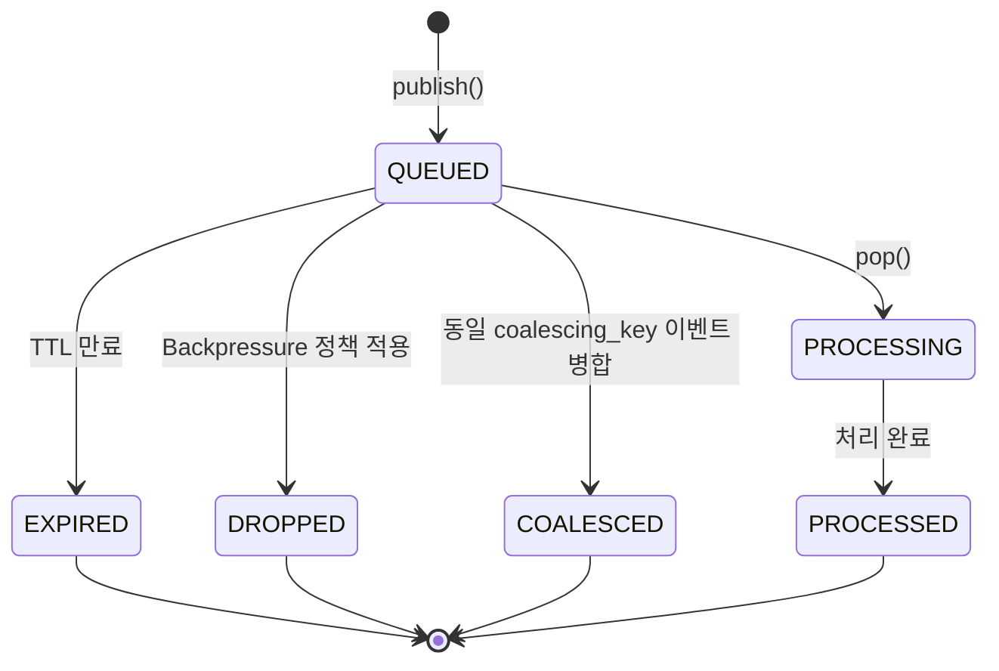
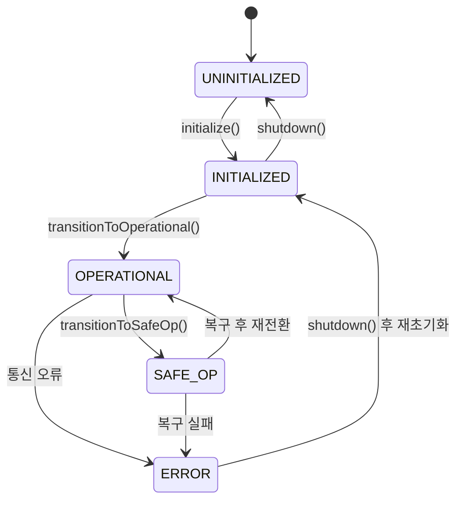
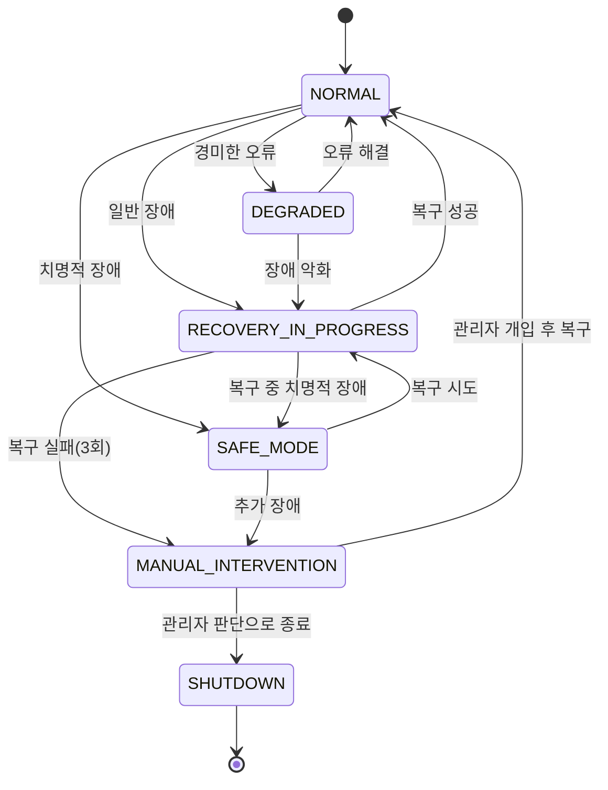
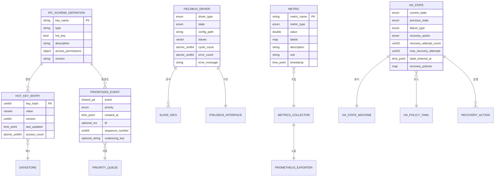

# Data Model: MXRC 아키텍처 개선 및 고도화

**Feature**: 019-architecture-improvements
**Date**: 2025-01-23
**Status**: Phase 1 Design
**Version**: 1.0.0

---

## 개요

이 문서는 MXRC 아키텍처 개선에 필요한 핵심 엔티티들의 데이터 모델을 정의합니다. 각 엔티티는 기능 요구사항(FR)을 충족하기 위해 설계되었으며, 타입 안전성, 성능, 확장성을 고려합니다.

## 엔티티 목록

1. [IPC Schema Definition](#1-ipc-schema-definition)
2. [Hot Key Entry](#2-hot-key-entry)
3. [Prioritized Event](#3-prioritized-event)
4. [Fieldbus Driver](#4-fieldbus-driver)
5. [Metric](#5-metric)
6. [HA State](#6-ha-state)

---

## 1. IPC Schema Definition

**목적**: DataStore 키와 EventBus 이벤트의 타입, 구조, 접근 권한을 명시적으로 정의하여 컴파일 타임 타입 안전성을 보장합니다.

**관련 요구사항**: FR-001, FR-002, FR-003, FR-004

### 1.1 DataStore Key Schema

#### 필드

- **key_name**: 키의 고유 식별자 (예: "robot_position", "robot_velocity")
- **type**: 데이터 타입 (예: Vector3d, double, int32_t, array<double, 8>)
- **hot_key**: Hot Key 최적화 대상 여부 (true/false)
- **description**: 키의 용도 및 의미에 대한 설명
- **access_permissions**: 프로세스별 접근 권한
  - **rt_read**: RT 프로세스 읽기 가능 여부
  - **rt_write**: RT 프로세스 쓰기 가능 여부
  - **nonrt_read**: Non-RT 프로세스 읽기 가능 여부
  - **nonrt_write**: Non-RT 프로세스 쓰기 가능 여부
- **version**: 스키마 버전 (시맨틱 버저닝)
- **deprecated**: 폐기 예정 여부 및 대체 키

#### 관계

- **복합 타입 정의와 참조 관계**: 커스텀 타입(예: Vector3d, RobotState)은 별도의 타입 정의를 참조합니다.
- **코드 생성 산출물과 1:N 관계**: 하나의 키 정의는 여러 C++ 코드 파일(Accessor, Struct 등)을 생성합니다.

#### 검증 규칙

1. **유일성**: key_name은 스키마 내에서 고유해야 합니다.
2. **타입 일관성**: type은 정의된 기본 타입 또는 복합 타입 목록에 존재해야 합니다.
3. **접근 권한 일관성**: rt_write가 true인 경우 rt_read도 true여야 합니다.
4. **Hot Key 제약**: hot_key가 true인 키는 최대 32개로 제한됩니다. (FR-006)
5. **버전 호환성**: 스키마 변경 시 기존 버전과의 하위 호환성을 검증해야 합니다. (FR-004)

#### 상태 전이

해당 없음 (정적 정의)

---

### 1.2 EventBus Event Schema

#### 필드

- **event_name**: 이벤트 타입 이름 (예: "EtherCATErrorEvent", "RobotStateChangedEvent")
- **priority**: 우선순위 레벨 (LOW, NORMAL, HIGH, CRITICAL)
- **ttl_ms**: 이벤트 유효 시간(Time-To-Live, 밀리초 단위)
- **coalescing**: 메시지 병합 정책 적용 여부 (true/false)
- **fields**: 페이로드 필드 목록
  - **field_name**: 필드 이름
  - **field_type**: 필드 타입
- **description**: 이벤트 설명
- **version**: 스키마 버전

#### 관계

- **PrioritizedEvent 엔티티와 연결**: EventBus Event Schema는 런타임 PrioritizedEvent 인스턴스의 템플릿입니다.
- **EventBus 구독자와 N:M 관계**: 하나의 이벤트 타입은 여러 구독자에게 전달될 수 있습니다.

#### 검증 규칙

1. **유일성**: event_name은 스키마 내에서 고유해야 합니다.
2. **우선순위 범위**: priority는 LOW, NORMAL, HIGH, CRITICAL 중 하나여야 합니다. (FR-008)
3. **TTL 범위**: ttl_ms는 양수이거나 null(무제한)이어야 합니다. (FR-009)
4. **필드 타입 일관성**: 모든 field_type은 정의된 타입 목록에 존재해야 합니다.
5. **Coalescing 제약**: coalescing이 true인 경우 동일 타입의 연속 이벤트 병합 로직이 정의되어야 합니다. (FR-010)

#### 상태 전이

해당 없음 (정적 정의)

---

## 2. Hot Key Entry

**목적**: 가장 빈번하게 접근되는 DataStore 키에 대해 Lock-Free 자료구조를 사용한 고성능 캐시 항목을 제공합니다.

**관련 요구사항**: FR-005, FR-006, FR-007

### 필드

- **key_hash**: 키 이름의 해시값 (uint64_t, 빠른 조회를 위해)
- **value**: 캐시된 데이터 값 (variant<double, int32_t, uint64_t, array<double, 3>, array<double, 8>>)
- **version**: 데이터 버전 (uint64_t, 일관성 검증용)
- **last_updated**: 마지막 업데이트 시각 (std::chrono::steady_clock::time_point)
- **access_count**: 접근 횟수 (atomic<uint64_t>, 통계용)

### 관계

- **DataStore Key Schema와 1:1 관계**: Hot Key Entry는 스키마에서 hot_key=true로 지정된 키에 대응됩니다.
- **Folly AtomicHashMap과 포함 관계**: 여러 Hot Key Entry가 하나의 AtomicHashMap에 저장됩니다.

### 검증 규칙

1. **개수 제한**: Hot Key Entry는 최대 32개로 제한됩니다. (research.md 참조)
2. **타입 크기 제약**: value의 크기는 512 bytes 이하여야 합니다 (64축 모터 데이터, 64개 IO 모듈 지원).
   - Vector3d: 24 bytes
   - array<double, 64>: 512 bytes (모터 위치/속도/토크)
   - array<uint64_t, 64>: 512 bytes (디지털 IO)
3. **버전 일관성**: 읽기 작업 시 version이 쓰기 시작 전후로 동일해야 데이터가 일관됩니다. (FR-007)
4. **성능 목표**: 읽기 작업은 평균 60ns 미만, 쓰기 작업은 평균 110ns 미만이어야 합니다. (FR-006)

### 상태 전이

해당 없음 (데이터 항목)

---

## 3. Prioritized Event

**목적**: EventBus에서 우선순위, TTL, Coalescing 정책을 지원하는 이벤트 래퍼를 제공합니다.

**관련 요구사항**: FR-008, FR-009, FR-010, FR-011

### 필드

- **event**: 실제 이벤트 객체 (shared_ptr<EventBase>)
- **priority**: 우선순위 (enum Priority: LOW=0, NORMAL=1, HIGH=2, CRITICAL=3)
- **created_at**: 이벤트 생성 시각 (std::chrono::steady_clock::time_point)
- **ttl**: 유효 시간 (optional<std::chrono::milliseconds>)
- **sequence_number**: 동일 우선순위 내 FIFO 순서 보장을 위한 시퀀스 번호 (uint64_t)
- **coalescing_key**: 병합 정책 적용 시 동일 이벤트 그룹을 식별하는 키 (optional<string>)

### 관계

- **EventBus Event Schema와 타입 연결**: 이벤트의 타입은 스키마에 정의된 event_name에 대응됩니다.
- **PriorityQueue와 포함 관계**: 여러 Prioritized Event가 하나의 PriorityQueue에 저장됩니다.

### 검증 규칙

1. **우선순위 범위**: priority는 LOW(0) ~ CRITICAL(3) 범위여야 합니다. (FR-008)
2. **TTL 유효성**: ttl이 설정된 경우 양수여야 합니다. (FR-009)
3. **만료 정책**: 이벤트가 큐에서 꺼내질 때 (현재 시각 - created_at) > ttl이면 폐기됩니다. (FR-009)
4. **우선순위 순서**: 우선순위가 높을수록 먼저 처리되며, 동일 우선순위 내에서는 FIFO 순서를 따릅니다.
5. **Coalescing 규칙**: coalescing_key가 동일한 이벤트들은 병합 가능하며, 가장 최신 이벤트만 유지됩니다. (FR-010)

### 상태 전이

---

## 4. Fieldbus Driver

**목적**: 다양한 필드버스 프로토콜(EtherCAT, CANopen, EtherNet/IP 등)을 통합된 인터페이스로 추상화하여 상위 레벨 코드의 재사용성을 높입니다.

**관련 요구사항**: FR-012, FR-013, FR-014

### 필드

- **driver_type**: 필드버스 프로토콜 타입 (enum FieldbusType: ETHERCAT, CANOPEN, ETHERNET_IP, MOCK)
- **state**: 필드버스 상태 (enum FieldbusState: UNINITIALIZED, INITIALIZED, OPERATIONAL, SAFE_OP, ERROR)
- **config_path**: 설정 파일 경로 (string)
- **slaves**: 연결된 슬레이브 목록 (vector<SlaveInfo>)
- **cycle_count**: 총 Cycle 수행 횟수 (atomic<uint64_t>)
- **error_count**: 총 오류 발생 횟수 (atomic<uint64_t>)
- **error_message**: 최근 오류 메시지 (string)
- **io_map**: 프로세스 데이터 이미지 (필드버스별 구현 의존적)

### 관계

- **IFieldbus 인터페이스 구현**: 모든 Fieldbus Driver는 IFieldbus 인터페이스를 구현합니다.
- **FieldbusFactory와 생성 관계**: FieldbusFactory가 설정에 따라 적절한 드라이버를 생성합니다.
- **RTExecutive/NonRTExecutive와 사용 관계**: Executive 계층에서 필드버스 드라이버를 통해 모터 제어 및 센서 데이터 수집을 수행합니다.

### 검증 규칙

1. **타입 일치**: driver_type은 설정 파일의 필드버스 타입과 일치해야 합니다. (FR-014)
2. **상태 전이 유효성**: 상태 전이는 정의된 규칙을 따라야 합니다(예: UNINITIALIZED → INITIALIZED → OPERATIONAL).
3. **슬레이브 정보 완전성**: 모든 슬레이브는 id, name, vendor, product_code를 포함해야 합니다.
4. **오류 처리**: error_count가 임계값을 초과하면 HA State Machine에 장애를 보고해야 합니다.
5. **성능 오버헤드**: 가상 함수 호출로 인한 오버헤드는 RT Cycle Time의 0.01% 미만이어야 합니다. (research.md 참조)

### 상태 전이

---

## 5. Metric

**목적**: RT/Non-RT 프로세스의 성능 및 상태 메트릭을 수집하고 Prometheus 포맷으로 노출하여 모니터링 및 알림을 지원합니다.

**관련 요구사항**: FR-015, FR-016, FR-017, FR-018

### 필드

- **metric_name**: 메트릭 이름 (string, Prometheus 명명 규칙 준수)
- **metric_type**: 메트릭 타입 (enum MetricType: COUNTER, GAUGE, HISTOGRAM, SUMMARY)
- **value**: 현재 메트릭 값 (double 또는 histogram buckets)
- **labels**: 메트릭 라벨 (map<string, string>, 예: {"task_id": "T001", "priority": "HIGH"})
- **description**: 메트릭 설명 (string)
- **unit**: 측정 단위 (string, 예: "microseconds", "bytes", "count")
- **timestamp**: 마지막 업데이트 시각 (std::chrono::system_clock::time_point)

### 관계

- **MetricsCollector와 집계 관계**: MetricsCollector가 여러 Metric을 관리하고 Prometheus Registry에 등록합니다.
- **Prometheus Exporter와 노출 관계**: Metrics는 HTTP 엔드포인트(/metrics)를 통해 Prometheus 서버에 노출됩니다.
- **Grafana 대시보드와 시각화 관계**: 메트릭은 Grafana 쿼리를 통해 대시보드에 표시됩니다.

### 검증 규칙

1. **명명 규칙**: metric_name은 Prometheus 규칙을 따라야 합니다(소문자, 밑줄 사용, "_total", "_bucket" 접미사).
2. **타입별 제약**:
   - **COUNTER**: 증가만 가능, 음수 불가
   - **GAUGE**: 증감 가능
   - **HISTOGRAM**: bucket boundaries 정의 필요
   - **SUMMARY**: quantile 정의 필요
3. **라벨 카디널리티**: 라벨 조합의 카디널리티가 과도하게 높으면 메모리 문제가 발생하므로 제한해야 합니다.
4. **수집 오버헤드**: RT 프로세스의 메트릭 수집은 Cycle Time의 1% 미만이어야 합니다. (FR-015)

### 상태 전이

해당 없음 (지속적으로 업데이트되는 데이터)

---

## 6. HA State

**목적**: 시스템 장애 발생 시 상태 머신 기반 복구 전략을 실행하여 고가용성을 보장합니다.

**관련 요구사항**: FR-019, FR-020, FR-021

### 필드

- **current_state**: 현재 HA 상태 (enum HAState: NORMAL, DEGRADED, SAFE_MODE, RECOVERY_IN_PROGRESS, MANUAL_INTERVENTION, SHUTDOWN)
- **previous_state**: 이전 HA 상태 (enum HAState)
- **failure_type**: 발생한 장애 유형 (enum FailureType: RT_PROCESS_CRASH, DEADLINE_MISS_CONSECUTIVE, ETHERCAT_COMM_FAILURE 등)
- **recovery_action**: 실행할 복구 액션 (enum RecoveryAction: RESTART_RT_PROCESS, ENTER_SAFE_MODE, NOTIFY_AND_WAIT 등)
- **recovery_attempt_count**: 복구 시도 횟수 (uint32_t)
- **max_recovery_attempts**: 최대 복구 시도 횟수 (uint32_t, 설정 파일에서 로드, 기본값 3)
- **state_entered_at**: 현재 상태 진입 시각 (std::chrono::steady_clock::time_point)
- **recovery_policies**: 장애 유형별 복구 정책 매핑 (map<FailureType, RecoveryAction>)

### 관계

- **ha-policy.yaml과 설정 관계**: recovery_policies는 YAML 설정 파일에서 로드됩니다.
- **HAStateMachine과 1:1 관계**: HAStateMachine이 HA State의 전이를 관리합니다.
- **Monitoring과 알림 관계**: 상태 전이 시 메트릭 및 로그를 기록하고 알림을 전송합니다.

### 검증 규칙

1. **상태 전이 유효성**: 상태 전이는 정의된 규칙을 따라야 합니다(예: NORMAL → SAFE_MODE는 허용, SHUTDOWN → NORMAL은 불가).
2. **복구 시도 제한**: recovery_attempt_count가 max_recovery_attempts를 초과하면 MANUAL_INTERVENTION 상태로 전이됩니다. (FR-020)
3. **복구 시간 목표**: 복구 액션은 10초 이내에 완료되어야 합니다. (SC-014)
4. **정책 완전성**: 모든 FailureType에 대해 RecoveryAction이 정의되어야 합니다.
5. **안전 우선**: 치명적 장애(DEADLINE_MISS_CONSECUTIVE, ETHERCAT_COMM_FAILURE)는 즉시 SAFE_MODE로 전이됩니다.

### 상태 전이

**상태별 진입 조건**:
- **NORMAL**: 초기 상태 또는 복구 성공 후
- **DEGRADED**: 일시적 센서 통신 실패, 경고 레벨 오류 발생
- **SAFE_MODE**: 연속 Deadline Miss, EtherCAT 통신 실패, 모터 과전류 등 치명적 장애
- **RECOVERY_IN_PROGRESS**: 복구 액션(프로세스 재시작, 부분 재시작 등) 실행 중
- **MANUAL_INTERVENTION**: 복구 시도 3회 실패, DataStore 손상, 알 수 없는 장애
- **SHUTDOWN**: 메모리 부족, 관리자 명령, 복구 불가능 상태

**상태별 종료 조건**:
- **NORMAL**: 장애 발생 시
- **DEGRADED**: 오류 해결 또는 장애 악화 시
- **SAFE_MODE**: 복구 시도 시작 또는 추가 장애 발생 시
- **RECOVERY_IN_PROGRESS**: 복구 성공/실패 또는 치명적 장애 발생 시
- **MANUAL_INTERVENTION**: 관리자 개입 후 정상 복귀 또는 종료 결정 시
- **SHUTDOWN**: 종료 완료 시

---

## 엔티티 관계 다이어그램

---

## 데이터 흐름 예시

### 예시 1: Hot Key 읽기 (Fast Path)

1. RT 프로세스가 "robot_position" 읽기 요청
2. DataStore가 HotKeyCache 조회 (key_hash 기반)
3. Hot Key Entry 발견 시 version 확인
4. 일관성 검증 후 value 반환 (<60ns 목표)

### 예시 2: 우선순위 이벤트 처리

1. RT 프로세스가 CRITICAL 우선순위 "AvoidReq" 이벤트 발행
2. EventBus가 PrioritizedEvent 생성 (priority=CRITICAL, ttl=5000ms)
3. PriorityQueue에 삽입 (우선순위 순 정렬)
4. Non-RT 프로세스가 pop() 호출 시 CRITICAL 이벤트 먼저 반환
5. TTL 만료 확인 후 처리 또는 폐기

### 예시 3: HA 복구 프로세스

1. RT 프로세스에서 연속 3회 Deadline Miss 발생
2. HA State Machine이 DEADLINE_MISS_CONSECUTIVE 장애 감지
3. ha-policy.yaml에서 복구 정책 조회 (action: ENTER_SAFE_MODE)
4. 상태 전이: NORMAL → SAFE_MODE
5. 복구 액션 실행: 모터 정지, 센서 모니터링만 유지
6. 관리자 개입 후 복구 성공 보고
7. 상태 전이: SAFE_MODE → RECOVERY_IN_PROGRESS → NORMAL

---

## 버전 관리

이 데이터 모델은 시맨틱 버저닝(Semantic Versioning)을 따릅니다:
- **MAJOR**: 엔티티 구조 변경, 필드 삭제, 타입 변경
- **MINOR**: 새 엔티티 추가, 새 필드 추가 (하위 호환)
- **PATCH**: 설명 개선, 검증 규칙 명확화

**현재 버전**: 1.0.0
**마지막 업데이트**: 2025-01-23
**다음 리뷰**: Phase 2 (Tasks 생성) 완료 후
