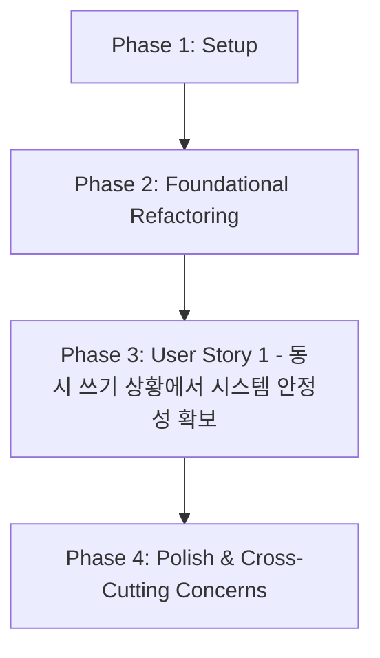

# 태스크 목록: DataStore 동시성 리팩토링

**기능 브랜치**: `020-refactor-datastore-locking`
**생성일**: 2025-11-16
**사양서**: [./spec.md](./spec.md)
**계획서**: [./plan.md](./plan.md)

## 요약

이 문서는 `DataStore` 모듈의 동시성 리팩토링을 위한 구현 태스크를 정의합니다. 주요 목표는 `DataStore`의 전역 락으로 인한 성능 병목 현상을 해결하고, `oneTBB`의 `concurrent_hash_map`을 사용하여 동시성 접근 시 시스템 안정성과 처리량을 향상시키는 것입니다.

## 태스크 의존성 그래프

## 병렬 실행 기회

이 기능은 단일 사용자 스토리에 집중하므로, 주요 병렬 실행 기회는 `DataStore` 내부 메서드(`set`, `get`, `remove`, `contains`)의 개별 구현 태스크 내에서 발생합니다.

## 구현 전략

MVP(Minimum Viable Product)는 `DataStore`의 내부 구현을 `oneTBB::concurrent_hash_map`으로 교체하고, 기존 테스트를 통과하며, 성능 병목 현상을 해결하는 것입니다. 이후 단계에서는 성능 벤치마킹 및 문서화가 진행됩니다.

---

## Phase 1: Setup (프로젝트 초기화)

- [ ] T001 `oneTBB` 라이브러리를 프로젝트의 `CMakeLists.txt`에 추가하고 링크 설정 `/CMakeLists.txt`
- [ ] T002 `oneTBB` 라이브러리가 빌드 시스템에 올바르게 통합되었는지 확인하는 더미 테스트 또는 컴파일 테스트 작성 `/tests/unit/datastore/tbb_integration_test.cpp`

---

## Phase 2: Foundational Refactoring (기본 리팩토링)

- [ ] T003 `src/core/datastore/DataStore.h`에 `oneTBB::concurrent_hash_map`을 내부 저장소로 포함하도록 선언
- [ ] T004 `src/core/datastore/DataStore.cpp`에서 `DataStore`의 내부 저장소를 `oneTBB::concurrent_hash_map` 인스턴스로 초기화
- [ ] T005 `src/core/datastore/DataStore.cpp`에서 `DataStore::set` 메서드를 `oneTBB::concurrent_hash_map`의 삽입/업데이트 로직을 사용하도록 수정
- [ ] T006 `src/core/datastore/DataStore.cpp`에서 `DataStore::get` 메서드를 `oneTBB::concurrent_hash_map`의 조회 로직을 사용하도록 수정
- [ ] T007 `src/core/datastore/DataStore.cpp`에서 `DataStore::remove` 메서드를 `oneTBB::concurrent_hash_map`의 제거 로직을 사용하도록 수정
- [ ] T008 `src/core/datastore/DataStore.cpp`에서 `DataStore::contains` 메서드를 `oneTBB::concurrent_hash_map`의 존재 확인 로직을 사용하도록 수정
- [ ] T009 `src/core/datastore/DataStore.h` 및 `src/core/datastore/DataStore.cpp`에서 기존의 전역 `DataStore::mutex_` 선언 및 사용 코드 제거

---

## Phase 3: User Story 1 - 동시 쓰기 상황에서 시스템 안정성 확보 [US1]

**스토리 목표**: `DataStore`의 전역 락으로 인한 성능 병목 현상을 해결하고, 동시성 접근 시 시스템 안정성과 처리량을 향상시킵니다.

**독립 테스트 기준**: `DataStoreEventAdapter`의 동시성 테스트(`ConcurrentEventBusPublish`, `ConcurrentDataStoreUpdates`)가 타임아웃 없이 일관되게 통과해야 합니다.

- [ ] T010 [US1] 기존 `DataStoreEventAdapter` 동시성 테스트(`tests/unit/event/DataStoreEventAdapter_test.cpp`)를 실행하여 리팩토링된 `DataStore`가 예상대로 동작하는지 확인
- [ ] T011 [US1] 성공 기준 SC-002(10개 동시 스레드, 각 100개 고유 키, 500ms 이내 완료)를 검증하기 위한 스트레스 테스트 작성 `/tests/integration/datastore/datastore_stress_test.cpp`
- [ ] T012 [US1] 기능 요구사항 FR-001, FR-002, FR-003, FR-004가 리팩토링된 `DataStore`에서 충족되는지 확인하는 통합 테스트 추가 `/tests/integration/datastore/datastore_functional_test.cpp`

---

## Phase 4: Polish & Cross-Cutting Concerns (다듬기 및 교차 기능)

- [ ] T013 `CLAUDE.md` (또는 관련 개발자 가이드)에 `oneTBB` 사용법 및 `DataStore`의 새로운 내부 구현에 대한 세부 정보 업데이트 `/CLAUDE.md`
- [ ] T014 `DataStore` 관련 코드의 주석 및 문서화 업데이트 `/src/core/datastore/DataStore.h`, `/src/core/datastore/DataStore.cpp`
- [ ] T015 성공 기준 SC-003(EventBus 블로킹 시간) 및 SC-004(CPU/메모리 사용량)를 확인하기 위한 성능 벤치마킹 수행 및 결과 문서화 `/docs/performance/datastore_benchmark_results.md`

---
