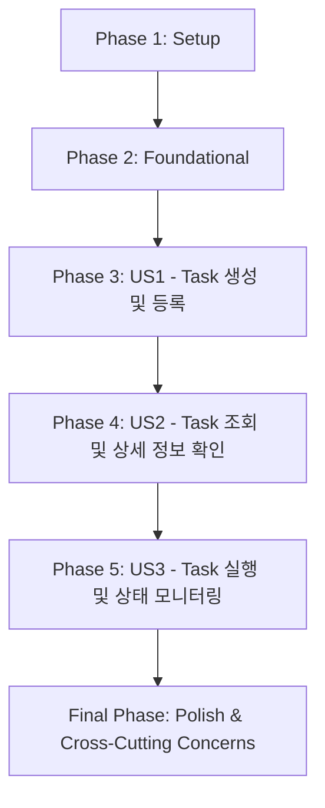

# Task 관리 모듈 개발 Task 목록

**기능 브랜치**: `001-task-management` | **날짜**: 2025-11-05 | **사양서**: /specs/001-task-management/spec.md

## 구현 전략

Task 관리 모듈은 MVP(Minimum Viable Product) 접근 방식을 사용하여 점진적으로 개발됩니다. 각 사용자 스토리는 독립적으로 구현 및 테스트 가능한 단위로 간주되며, 우선순위(P1, P2, P3)에 따라 순차적으로 진행됩니다. SOLID 원칙을 준수하여 모듈 간의 낮은 결합도와 높은 응집도를 유지하며, 확장성과 유지보수성을 확보합니다.

## 의존성 그래프

## 병렬 실행 예시

각 사용자 스토리는 독립적으로 테스트 가능하도록 설계되었으므로, 다음 단계에서 병렬 개발이 가능합니다.

- **사용자 스토리 1**: Task 정의 및 등록 관련 `ITaskManager` 및 `IOperatorInterface` 구현, 그리고 관련 단위 테스트.
- **사용자 스토리 2**: 등록된 Task 조회 관련 `ITaskManager` 및 `IOperatorInterface` 구현, 그리고 관련 단위 테스트.
- **사용자 스토리 3**: Task 실행 요청 및 상태 모니터링 관련 `ITaskManager` 및 `IOperatorInterface` 구현, 그리고 관련 단위 테스트.

## Phase 1: Setup

- [x] T001 `src/core/task/` 디렉토리 생성
- [x] T002 `tests/unit/task/` 디렉토리 생성
- [ ] T003 `src/core/task/` 및 `tests/unit/task/`에 대한 CMakeLists.txt 파일 업데이트 (CMakeLists.txt 파일이 존재하지 않아 건너뜀)

## Phase 2: Foundational

- [x] T004 `TaskDto` 구조체 정의 및 공통 헤더 파일 생성 (예: `src/core/task/TaskDto.h`)
- [x] T005 `ITaskManager` 인터페이스 구현 (헤더 파일: `src/core/task/ITaskManager.h`)
- [x] T006 `IOperatorInterface` 인터페이스 구현 (헤더 파일: `src/core/task/IOperatorInterface.h`)

## Phase 3: 사용자 스토리 1 - 새로운 Task 생성 및 등록 [US1]

**스토리 목표**: 사용자는 시스템에 새로운 Task를 정의하고 등록할 수 있어야 한다.
**독립 테스트 기준**: Task 정의 및 등록 API를 호출하여 Task가 성공적으로 생성되고 시스템에 등록되는지 확인할 수 있다.

- [x] T007 [US1] `Task` 엔티티 클래스 구현 (파일: `src/core/task/Task.h`, `src/core/task/Task.cpp`)
- [x] T008 [US1] `TaskManager` 클래스 구현 및 `ITaskManager` 인터페이스 상속 (파일: `src/core/task/TaskManager.h`, `src/core/task/TaskManager.cpp`)
- [x] T009 [US1] `OperatorInterface` 클래스 구현 및 `IOperatorInterface` 인터페이스 상속 (파일: `src/core/task/OperatorInterface.h`, `src/core/task/OperatorInterface.cpp`)
- [x] T010 [US1] `TaskManager::registerTaskDefinition` 구현
- [x] T011 [US1] `OperatorInterface::defineNewTask` 구현
- [x] T012 [US1] Task 등록 기능에 대한 단위 테스트 작성 (파일: `tests/unit/task/TaskManager_test.cpp`, `tests/unit/task/OperatorInterface_test.cpp`)

## Phase 4: 사용자 스토리 2 - 등록된 Task 조회 및 상세 정보 확인 [US2]

**스토리 목표**: 사용자는 시스템에 등록된 모든 Task 목록을 조회하거나 특정 Task의 상세 정보를 확인할 수 있어야 한다.
**독립 테스트 기준**: 등록된 Task 목록 조회 API 및 특정 Task 상세 정보 조회 API를 호출하여 올바른 정보가 반환되는지 확인할 수 있다.

- [x] T013 [US2] `TaskManager::getAllTaskDefinitions` 구현
- [x] T014 [US2] `TaskManager::getTaskDefinitionById` 구현
- [x] T015 [US2] `OperatorInterface::getAvailableTasks` 구현
- [x] T016 [US2] `OperatorInterface::getTaskDetails` 구현
- [x] T017 [US2] Task 조회 기능에 대한 단위 테스트 작성 (파일: `tests/unit/task/TaskManager_test.cpp`, `tests/unit/task/OperatorInterface_test.cpp`)

## Phase 5: 사용자 스토리 3 - Task 실행 요청 및 상태 모니터링 [US3]

**스토리 목표**: 사용자는 등록된 Task의 실행을 요청하고, 실행 중인 Task의 현재 상태를 모니터링할 수 있어야 한다.
**독립 테스트 기준**: Task 실행 요청 API를 호출하고, Task 상태 모니터링 API를 통해 상태 변화를 추적할 수 있다.

- [x] T018 [US3] `TaskManager::requestTaskExecution` 구현
- [x] T019 [US3] `TaskManager::getTaskExecutionStatus` 구현
- [x] T020 [US3] `OperatorInterface::startTaskExecution` 구현
- [x] T021 [US3] `OperatorInterface::monitorTaskStatus` 구현
- [x] T022 [US3] Task 실행 및 상태 모니터링 기능에 대한 단위 테스트 작성 (파일: `tests/unit/task/TaskManager_test.cpp`, `tests/unit/task/OperatorInterface_test.cpp`)

## Final Phase: Polish & Cross-Cutting Concerns

- [ ] T023 엣지 케이스(등록되지 않은 Task 실행 요청, 동시성 관리, 예외 상황 복구)에 대한 오류 처리 로직 구현
- [ ] T024 외부 저장소 모듈과의 통합 (Task 정의 영구 저장 및 검색)
- [ ] T025 외부 Task 실행기와의 통합 (실제 Task 실행 로직 위임)
- [ ] T026 모듈 전반에 걸친 코드 리뷰 및 리팩토링
- [ ] T027 Doxygen을 이용한 API 문서화 업데이트
- [ ] T028 통합 테스트 작성 및 실행 (파일: `tests/integration/task/TaskManagement_integration_test.cpp`)
