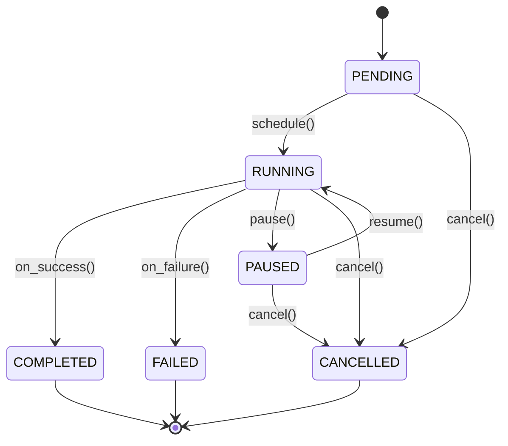

# 데이터 모델: Task & Mission Management

**브랜치**: `004-task-mission-management` | **날짜**: 2025-11-04 | **사양서**: [spec.md](./spec.md)

## 개요

이 문서는 `Task & Mission Management` 모듈의 주요 엔티티와 그 관계를 정의합니다. 이 데이터 모델은 `DataStore` 의존성을 제거하고 모듈의 독립성을 강화하는 리팩터링의 결과를 반영합니다.

## 엔티티 다이어그램 (개념)

```mermaid
graph TD
    subgraph Task & Mission Management Module
        OperatorInterface -- controls --> MissionManager
        MissionManager -- uses --> BehaviorTree
        MissionManager -- manages --> TaskScheduler
        MissionManager -- uses --> TaskFactory
        MissionManager -- uses --> ResourceManager
        MissionManager -- uses --> TaskDependencyManager
        BehaviorTree -- contains --> Task
        TaskScheduler -- schedules --> Task
        TaskFactory -- creates --> Task
        Task -- uses --> TaskContext
        Task -- requires --> ResourceManager
        TaskDependencyManager -- manages dependencies of --> Task
    end

    subgraph External Modules
        DataStoreInterface(IDataStore)
    end

    MissionManager -.->|uses (injected)| DataStoreInterface

    style DataStoreInterface fill:#f9f,stroke:#333,stroke-width:2px,color:#000
```

## 주요 엔티티 설명

### 1. MissionManager
- **설명**: Mission의 전체 생명주기와 실행을 관리하는 핵심 오케스트레이터입니다. Behavior Tree 실행 엔진을 내장하고 있으며, Mission의 시작, 중지, 재개, 상태 모니터링 등을 담당합니다.
- **관계**:
    - `OperatorInterface`로부터 제어 명령을 받습니다.
    - `BehaviorTree`를 사용하여 Mission의 로직을 실행합니다.
    - `TaskScheduler`, `TaskFactory`, `ResourceManager`, `TaskDependencyManager` 등 하위 컴포넌트들을 조정합니다.
    - **(리팩터링 핵심)** `IDataStore` 인터페이스에 대한 의존성을 가지며, 구체적인 구현은 외부에서 주입받습니다. 영속성 로직과 직접적인 결합이 없습니다.

### 2. Task
- **설명**: 로봇이 수행하는 가장 작은 작업 단위입니다(예: `DriveToPosition`, `LiftPallet`). 자체적인 상태(`PENDING`, `RUNNING`, `COMPLETED` 등)와 생명주기, 오류 처리 로직을 가집니다.
- **필드**: `taskId`, `status`, `failureStrategy`, `priority`.
- **관계**: `BehaviorTree`의 Action 노드로 표현되며, `TaskScheduler`에 의해 실행 순서가 결정됩니다.

### 3. BehaviorTree
- **설명**: Mission의 복잡한 제어 흐름(순차, 분기, 병렬 등)을 정의하는 데 사용되는 트리 구조입니다. `vendor/BehaviorTree.CPP` 라이브러리를 활용합니다.
- **관계**: `MissionManager`에 의해 실행되며, `Task`를 포함하는 Action 노드들로 구성됩니다.

### 4. TaskContext
- **설명**: Task 실행에 필요한 입력 파라미터와 Task 실행 후의 출력 결과를 담는 데이터 컨테이너입니다. Task 간 데이터 공유에도 사용될 수 있습니다.

### 5. OperatorInterface
- **설명**: 운영자가 Mission 및 개별 Task를 모니터링하고 제어 명령(시작, 중지, 재개 등)을 내릴 수 있는 인터페이스입니다.

### 6. ResourceManager
- **설명**: 로봇의 하드웨어 및 소프트웨어 리소스(예: 로봇 팔, 센서)를 관리하고, Task 실행에 필요한 리소스의 할당 및 해제를 담당합니다.

### 7. DataStore (`IDataStore` 인터페이스)
- **설명**: Mission 및 Task 관련 영속적인 데이터를 저장하고 관리하는 **외부 모듈의 추상 인터페이스**입니다. `Task & Mission Management` 모듈은 이 인터페이스에만 의존하며, 실제 구현(인메모리, DB 등)은 알지 못합니다.
- **역할**: Mission 상태, Task 이력 등의 저장 및 조회를 위한 메서드를 정의합니다.
- **상태**: 이 모듈의 책임 범위를 벗어납니다. 구현은 별도의 모듈에서 제공되고 런타임에 주입됩니다.

## 상태 모델: TaskState



## 데이터 흐름

1.  `OperatorInterface`가 `MissionManager`에게 Mission 실행을 요청합니다.
2.  `MissionManager`는 Mission 파일을 파싱하여 `BehaviorTree`를 생성합니다.
3.  `MissionManager`는 `BehaviorTree`를 실행(tick)합니다.
4.  실행할 `Task`가 결정되면, `TaskScheduler`가 우선순위와 의존성에 따라 Task를 `RUNNING` 상태로 전환합니다.
5.  `Task` 실행 중 상태 변경이 발생하면, `MissionManager`는 이 정보를 `OperatorInterface`에 전달하고, (주입된) `IDataStore` 구현체를 통해 상태를 기록하도록 요청합니다.
6.  Task 완료/실패 후, `MissionManager`는 다음 `BehaviorTree` 노드를 실행합니다.
7.  Mission이 완료/실패/취소되면, `MissionManager`는 최종 상태를 `IDataStore`에 기록하고 `OperatorInterface`에 보고합니다.