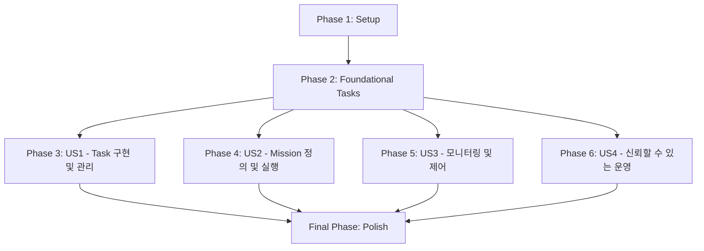

# 구현 태스크: Task & Mission Management (Task 및 임무 관리) 고도화

**기능 브랜치**: `004-task-mission-management`
**생성일**: 2025-11-03
**사양서**: [specs/004-task-mission-management/spec.md](specs/004-task-mission-management/spec.md)
**계획**: [specs/004-task-mission-management/plan.md](specs/004-task-mission-management/plan.md)

## Phase 1: Setup

- [ ] T001 `src/core/datastore/DataStore.h`에 `remove(const std::string& id)` 메서드 선언
- [ ] T002 `src/core/datastore/DataStore.cpp`에 `remove(const std::string& id)` 메서드 구현
- [ ] T003 `src/core/task_mission_management/` 디렉토리에 Behavior Tree 라이브러리 (BehaviorTree.CPP) 통합 및 설정

## Phase 2: Foundational Tasks

- [ ] T004 `src/core/task_mission_management/IDataStore.h` 인터페이스를 구현하는 `DataStoreAdapter.h` 및 `DataStoreAdapter.cpp` 생성
- [ ] T005 `src/core/task_mission_management/IDataStore.h` 인터페이스를 구현하는 `DataStoreAdapter` 클래스 구현
- [ ] T006 `src/core/task_mission_management/MissionManager.h` 및 `MissionManager.cpp` 파일 생성 (IMissionManager 인터페이스 구현 시작)
- [ ] T007 `src/core/task_mission_management/OperatorInterface.h` 및 `OperatorInterface.cpp` 파일 생성 (IOperatorInterface 인터페이스 구현 시작)

## Phase 3: 사용자 스토리 1 - 독립적이고 견고한 Task 구현 및 관리 [P1]

**스토리 목표**: 개발자는 로봇의 모든 주요 동작을 독립적이고 재사용 가능한 `Task` 단위로 구현하고 관리할 수 있으며, 각 Task는 예상치 못한 상황에서도 견고하게 동작해야 합니다.

**독립 테스트 기준**: 각 Task를 개별적으로 실행하고, 예상된 결과를 반환하는지, 그리고 외부 상태에 의도치 않은 영향을 미치지 않는지 검증할 수 있습니다. 비정상적인 입력이나 외부 환경 변화에도 Task가 안정적으로 실패를 처리하거나 복구하는지 테스트할 수 있습니다. Task의 상태 전이가 올바르게 발생하는지, 그리고 각 상태에서 예상된 동작을 수행하는지 검증할 수 있습니다.

- [ ] T008 [P] [US1] `src/core/task_mission_management/tasks/DriveToPositionTask.h` 및 `DriveToPositionTask.cpp` 생성 (AbstractTask 상속)
- [ ] T009 [P] [US1] `src/core/task_mission_management/tasks/LiftPalletTask.h` 및 `LiftPalletTask.cpp` 생성 (AbstractTask 상속)
- [ ] T010 [US1] `tests/unit/task_mission_management/DriveToPositionTask_test.cpp`에 `DriveToPositionTask` 단위 테스트 작성
- [ ] T011 [US1] `tests/unit/task_mission_management/LiftPalletTask_test.cpp`에 `LiftPalletTask` 단위 테스트 작성

## Phase 4: 사용자 스토리 2 - 동적이고 유연한 Mission(워크플로우) 정의 및 실행 [P1]

**스토리 목표**: 운영자는 여러 Task를 조합하여 복잡한 임무(Mission)를 순차, 분기, 반복, 병렬 실행 등 다양한 제어 흐름을 가진 워크플로우로 정의하고 실행할 수 있으며, Mission 실행 중에도 동적으로 Mission의 흐름을 변경하거나 긴급 Task를 삽입할 수 있어야 합니다.

**독립 테스트 기준**: JSON 또는 YAML 형식의 Mission 설정 파일을 작성하고, 로봇이 해당 파일에 정의된 워크플로우대로 정확히 동작하는지 시뮬레이션 및 실제 환경에서 검증할 수 있습니다. Mission 실행 중 외부 명령에 의해 Mission 흐름이 변경되거나 긴급 Task가 삽입되었을 때, 시스템이 예상대로 동작하는지 검증할 수 있습니다. Task의 우선순위 및 의존성 설정에 따라 Task가 올바른 순서로 실행되는지 검증할 수 있습니다.

- [ ] T012 [US2] `src/core/task_mission_management/MissionDefinitionParser.h` 및 `MissionDefinitionParser.cpp` 생성 (JSON/YAML 파싱 및 스키마/ID 유효성 검사)
- [ ] T013 [US2] `src/core/task_mission_management/TaskScheduler.h` 및 `TaskScheduler.cpp` 생성 (Task 우선순위 및 리소스 할당 관리)
- [ ] T014 [US2] `src/core/task_mission_management/TaskDependencyManager.h` 및 `TaskDependencyManager.cpp` 생성 (Task 의존성 관리)
- [ ] T015 [US2] `src/core/task_mission_management/MissionManager.cpp`에 Mission 로딩 및 Behavior Tree 실행 로직 구현
- [ ] T016 [US2] `tests/unit/task_mission_management/MissionManager_Execution_test.cpp`에 Mission 실행 흐름 (순차, 분기, 반복, 병렬) 단위 테스트 작성
- [ ] T017 [US2] `tests/unit/task_mission_management/MissionDefinitionParser_test.cpp`에 Mission 정의 파일 파싱 및 유효성 검사 단위 테스트 작성

## Phase 5: 사용자 스토리 3 - Mission 및 Task 실행 상태 실시간 모니터링 및 제어 [P2]

**스토리 목표**: 운영자는 실행 중인 Mission의 현재 상태, 각 Task의 진행 상황, 예상 완료 시간 등을 실시간으로 모니터링하고, 필요한 경우 Mission 또는 개별 Task를 일시 중지, 재개, 취소할 수 있어야 합니다. 또한, Task의 상태 변화 이력을 조회할 수 있어야 합니다.

**독립 테스트 기준**: Mission 및 개별 Task 실행 중 웹 인터페이스 또는 전용 모니터링 도구를 통해 Mission 및 Task 상태가 실시간으로 업데이트되는지 확인하고, 해당 도구를 통해 Mission 또는 Task 제어 명령(일시 중지, 재개, 취소)을 내렸을 때 로봇이 예상대로 동작하는지 검증할 수 있습니다. Task 상태 변화 이력이 정확하게 기록되고 조회되는지 검증할 수 있습니다.

- [ ] T018 [US3] `src/core/task_mission_management/OperatorInterface.cpp`에 Mission 및 Task 상태 조회 기능 구현
- [ ] T019 [US3] `src/core/task_mission_management/OperatorInterface.cpp`에 Mission 및 Task 제어 명령 (일시 중지, 재개, 취소) 기능 구현
- [ ] T020 [US3] `src/core/task_mission_management/TaskStateLogger.h` 및 `TaskStateLogger.cpp` 생성 (Task 상태 변화 이력 기록)
- [ ] T021 [US3] `tests/unit/task_mission_management/OperatorInterface_test.cpp`에 모니터링 및 제어 기능 단위 테스트 작성
- [ ] T022 [US3] `tests/unit/task_mission_management/TaskStateLogger_test.cpp`에 Task 상태 이력 기록 및 조회 단위 테스트 작성

## Phase 6: 사용자 스토리 4 - 신뢰할 수 있는 Mission 및 Task 운영 [P1]

**스토리 목표**: 운영자는 Mission 및 Task의 정의, 실행, 제어 과정에서 시스템의 무결성이 보장되어야 하며, 모든 중요한 작업은 기록되어 추적 가능해야 합니다. 또한, 시스템 장애 발생 시 Mission이 안전하게 복구될 수 있어야 합니다.

**독립 테스트 기준**: 모든 Mission 시작/종료, Task 상태 변경, 운영자 명령 등이 정확하게 기록되고, 기록된 로그가 위변조되지 않았는지 검증할 수 있습니다. 시스템이 예기치 않게 종료된 후 Mission이 마지막으로 알려진 안전한 상태에서 복구되는지 검증할 수 있습니다.

- [ ] T023 [US4] `src/core/task_mission_management/AuditLogger.h` 및 `AuditLogger.cpp` 생성 (중요 이벤트 감사 로그 기록)
- [ ] T024 [US4] `src/core/task_mission_management/MissionRecoveryManager.h` 및 `MissionRecoveryManager.cpp` 생성 (시스템 종료 후 Mission 상태 복구)
- [ ] T025 [US4] `src/core/task_mission_management/SecureCommunication.h` 및 `SecureCommunication.cpp` 생성 (통신 채널 암호화 및 메시지 무결성)
- [ ] T026 [US4] `tests/unit/task_mission_management/AuditLogger_test.cpp`에 감사 로그 기록 및 무결성 단위 테스트 작성
- [ ] T027 [US4] `tests/unit/task_mission_management/MissionRecoveryManager_test.cpp`에 Mission 복구 시나리오 단위 테스트 작성

## Final Phase: Polish & Cross-Cutting Concerns

- [ ] T028 개발자 문서 (API 레퍼런스, 사용 가이드) 업데이트
- [ ] T029 시스템 성능 프로파일링 및 최적화
- [ ] T030 전반적인 오류 처리 및 보고 메커니즘 강화

## 의존성 그래프

## 병렬 실행 기회

- **Phase 3 (US1)**: `T008`과 `T009`는 독립적으로 병렬 구현 가능합니다. `T010`과 `T011`도 각 Task 구현 완료 후 병렬로 진행 가능합니다.

## 구현 전략

MVP (Minimum Viable Product)는 사용자 스토리 1과 2의 핵심 기능을 구현하는 것을 목표로 합니다. 이후 사용자 스토리 3, 4를 순차적으로 구현하여 기능을 확장합니다. 각 사용자 스토리는 독립적으로 테스트 가능한 단위로 개발됩니다.
