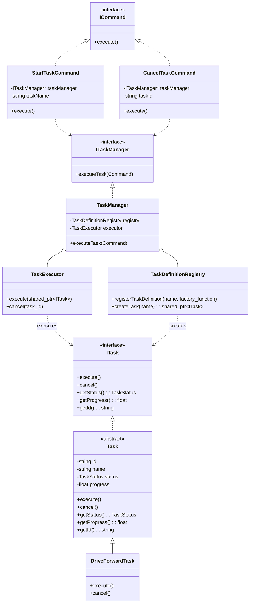

# 데이터 모델: TaskManager 리팩터링

**날짜**: 2025-11-13
**사양서**: [spec.md](./spec.md)

## 개요

이 문서는 `TaskManager` 모듈 리팩터링에 따른 데이터 모델의 변경 사항을 정의합니다. 새로운 클래스가 도입되고 기존 클래스의 역할이 변경됩니다.

## 클래스 다이어그램 (개념)

## 주요 엔티티 상세

### 1. `TaskDefinitionRegistry`

- **역할**: Task의 "청사진" 또는 메타데이터를 등록하고 관리합니다. Task의 이름과 해당 Task를 생성할 수 있는 팩토리 함수를 매핑합니다.
- **주요 속성/메서드**:
    - `registerTaskDefinition(std::string name, std::function<std::shared_ptr<ITask>()> factory)`: 새로운 Task 유형을 등록합니다.
    - `createTask(std::string name)`: 등록된 Task 이름으로 새로운 Task 인스턴스를 생성합니다.
- **관계**: `TaskManager`에 의해 소유되고 사용됩니다. `TaskFactory`의 역할을 대체하거나 `TaskFactory`를 내부적으로 사용할 수 있습니다.

### 2. `TaskExecutor`

- **역할**: `ITask` 객체의 실행 생명주기를 관리합니다. Task를 비동기적으로 실행하고, 취소/일시 중지 등의 요청을 처리합니다. 스레드 풀을 내부적으로 관리할 수 있습니다.
- **주요 속성/메서드**:
    - `execute(std::shared_ptr<ITask> task)`: 주어진 Task를 실행 대기열에 추가하거나 즉시 실행합니다.
    - `cancel(std::string taskId)`: 실행 중인 Task를 취소합니다.
    - `getActiveTasks()`: 현재 실행 중인 Task 목록을 반환합니다.
- **관계**: `TaskManager`에 의해 소유되고 사용됩니다.

### 3. `ITask` / `Task`

- **역할**: 데이터와 행위가 통합된 실행 가능한 Task 객체입니다. 기존의 `Task`(데이터)와 `ITask`(행위)의 역할이 이 클래스로 통합됩니다. `Task`는 `ITask`를 구현하는 추상 기반 클래스가 될 수 있습니다.
- **주요 속성/메서드**:
    - `id`, `name`, `status`, `progress`: Task의 상태 데이터를 나타내는 멤버 변수 (private).
    - `execute()`: Task의 실제 실행 로직. 이 메서드 내에서 `status`와 `progress`가 변경됩니다.
    - `cancel()`: Task의 실행을 중단하는 로직.
    - `getStatus()`, `getProgress()`, `getId()`: 상태 정보를 외부에 제공하는 `getter` 메서드.
- **상태 전이**:
    - Task의 상태(`PENDING`, `RUNNING`, `COMPLETED`, `FAILED`, `CANCELLED`)는 오직 `execute()`, `cancel()`과 같은 내부 메서드에 의해서만 변경되어야 합니다.

### 4. `ICommand` / `StartTaskCommand` / `CancelTaskCommand`

- **역할**: Task에 대한 모든 조작을 캡슐화하는 Command 객체입니다.
- **주요 속성/메서드**:
    - `execute()`: `TaskManager`를 통해 해당 명령을 실행합니다.
    - `StartTaskCommand`: 생성할 Task의 이름과 파라미터를 가집니다.
    - `CancelTaskCommand`: 취소할 Task의 ID를 가집니다.
- **관계**: 외부(예: `OperatorInterface`)에서 생성되어 `TaskManager`로 전달됩니다.

### 5. `TaskManager` (Refactored)

- **역할**: 시스템의 다른 부분과 `taskmanager` 하위 시스템 간의 Facade 역할을 합니다. Task 실행 요청을 받아 `TaskDefinitionRegistry`와 `TaskExecutor`에 위임합니다.
- **주요 속성/메서드**:
    - `executeTask(std::shared_ptr<ICommand> command)`: Command를 받아 처리합니다.
- **관계**: `TaskDefinitionRegistry`와 `TaskExecutor`를 소유하고 조정(coordinate)합니다. `ITaskManager` 인터페이스를 구현합니다.
