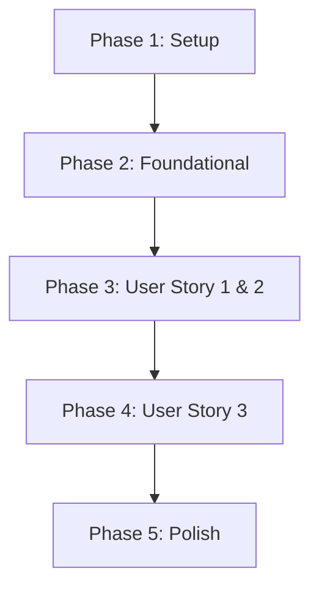

# Actionable Tasks for: RT/Non-RT 아키텍처 및 로깅 시스템 개선

**Feature**: `021-refactor-rt-logging-ipc`
**Version**: 1.0
**Date**: 2025-11-21
**Relevant Spec**: [spec.md](spec.md)
**Relevant Plan**: [plan.md](plan.md)

---

## 📍 Implementation Strategy

본 기능의 구현은 MVP(Minimum Viable Product) 우선 접근 방식을 따릅니다. **User Story 1**과 **User Story 2**를 포함하는 Foundational 로깅 아키텍처를 먼저 완성하여, 가장 시급한 문제인 '안정적인 실시간 로깅'을 해결합니다. 이후 **User Story 3**의 Heartbeat 기능을 추가하여 시스템 안정성을 더욱 강화합니다.

- **MVP Scope**: Phase 1, 2, 3, 4. (실시간 성능에 영향을 주지 않는 통합 로깅)
- **Post-MVP**: Phase 5. (프로세스 간 장애 감지)

---

## 🔗 Dependencies

User Story 간의 의존성은 다음과 같습니다. 각 User Story는 이전 Story의 완성을 전제로 합니다.

---

## 📋 Task Checklist

### Phase 1: 프로젝트 설정 (Setup)
- [ ] **T001** `CMakeLists.txt` 파일을 수정하여 `Boost.Lockfree` 라이브러리를 찾고, 프로젝트에 연동하는 설정을 추가합니다.

### Phase 2: 핵심 기반 구현 (Foundational)
- [ ] **T002** `data-model.md`에 명시된 `LogRecord` 구조체를 `src/core/ipc/log_record.h` 파일에 정의합니다.
- [ ] **T003** [P] `data-model.md`에 명시된 `IpcMessage` 구조체와 관련 열거형을 `src/core/ipc/ipc_message.h` 파일에 정의합니다.
- [ ] **T004** `research.md`의 설계에 따라, `mmap`과 원자적 인덱스를 사용하는 `ShmRingBuffer` 클래스를 `src/core/ipc/shm_ring_buffer.h` 및 `src/core/ipc/shm_ring_buffer.cpp` 파일에 구현합니다. `ILogBuffer` 인터페이스를 상속받아야 합니다.
- [ ] **T005** [P] `boost::lockfree::spsc_queue`를 래핑하는 `SpscQueue` 템플릿 클래스를 `src/core/ipc/spsc_queue.h` 파일에 구현합니다. `IIpcQueue` 인터페이스를 상속받아야 합니다.

### Phase 3: 통합 로깅 구현 (User Story 1 & 2)
> **Goal**: RT와 Non-RT 프로세스의 로그를 통합하고, 실시간 성능을 보장합니다.
> **Independent Test**: RT 프로세스에서 대량의 로그를 발생시켜도 Non-RT 프로세스의 로그 파일에 모든 로그가 시간 순으로 통합 기록되며, RT Task의 실행 시간(jitter)이 허용치 이내인지 확인합니다.

- [ ] **T006** [US1] `spdlog`의 커스텀 sink인 `ShmSink`를 `src/core/logging/sinks/shm_sink.h` 파일에 구현합니다. 이 sink는 내부적으로 `ShmRingBuffer`를 사용하여 로그를 공유 메모리에 씁니다.
- [ ] **T007** [US1] `LogConsumer` 클래스를 `src/core/nonrt/log_consumer.h` 및 `src/core/nonrt/log_consumer.cpp` 파일에 구현합니다. 이 클래스는 `ShmRingBuffer`에서 로그를 주기적으로 읽어와 파일 로거에 전달하는 역할을 합니다.
- [ ] **T008** [US1] `src/rt_main.cpp` 파일을 수정하여 `spdlog`의 기본 로거가 `ShmSink`를 사용하도록 설정합니다.
- [ ] **T009** [US1] `src/nonrt_main.cpp` 파일을 수정하여 `LogConsumer`를 별도의 스레드에서 실행하도록 초기화 코드를 추가합니다.
- [ ] **T010** [US1] `ShmRingBuffer`의 기본 동작(쓰기/읽기/오버플로우)을 검증하는 단위 테스트를 `tests/unit/ipc/shm_ring_buffer_test.cpp` 파일에 작성합니다.
- [ ] **T011** [US2] RT 프로세스의 로깅 성능을 측정하는 벤치마크 테스트를 `tests/benchmark/logging/rt_logging_benchmark.cpp` 파일에 작성하여, spec의 성능 요구사항(jitter < 10μs) 충족 여부를 검증합니다.

### Phase 4: 프로세스 장애 감지 구현 (User Story 3)
> **Goal**: Heartbeat 메커니즘을 통해 프로세스 간 장애를 감지합니다.
> **Independent Test**: Non-RT 프로세스를 강제 종료했을 때, RT 프로세스가 500ms 내에 이를 감지하고 'critical' 로그를 남기는지 확인합니다.

- [ ] **T012** [P] [US3] `HealthMonitor` 클래스를 `src/core/rt/health_monitor.h` 및 `src/core/rt/health_monitor.cpp` 파일에 구현합니다. 이 모니터는 주기적으로 `SpscQueue`를 통해 Heartbeat 메시지를 전송합니다.
- [ ] **T013** [P] [US3] `HealthMonitor` 클래스를 `src/core/nonrt/health_monitor.h` 및 `src/core/nonrt/health_monitor.cpp` 파일에 구현합니다. 이 모니터는 자신의 Heartbeat를 보내고, 상대방의 Heartbeat를 `SpscQueue`에서 수신하여 상태를 점검합니다.
- [ ] **T014** [US3] `rt_main.cpp`와 `nonrt_main.cpp`에 각 프로세스에 맞는 `HealthMonitor`를 초기화하고 실행하는 코드를 추가합니다.
- [ ] **T015** [US3] 프로세스 장애 상황을 시뮬레이션하고 Heartbeat 감지를 검증하는 통합 테스트를 `tests/integration/ipc/health_monitor_integration_test.cpp` 파일에 작성합니다.

### Phase 5: 마무리 및 정리 (Polish)
- [ ] **T016** `README.md`와 빌드 관련 문서에 `Boost` 라이브러리 의존성이 추가되었음을 명시하고, 빌드 방법을 업데이트합니다.
- [ ] **T017** 최상위 `CMakeLists.txt`를 수정하여 `ipc`, `logging`, `rt`, `nonrt` 디렉토리에 추가된 모든 신규 소스 파일과 테스트 파일이 빌드에 포함되도록 합니다.
- [ ] **T018** 코드 전체에 대해 코드 포맷팅(`clang-format`)과 정적 분석(`cppcheck` 등)을 실행하여 일관성을 유지합니다.
